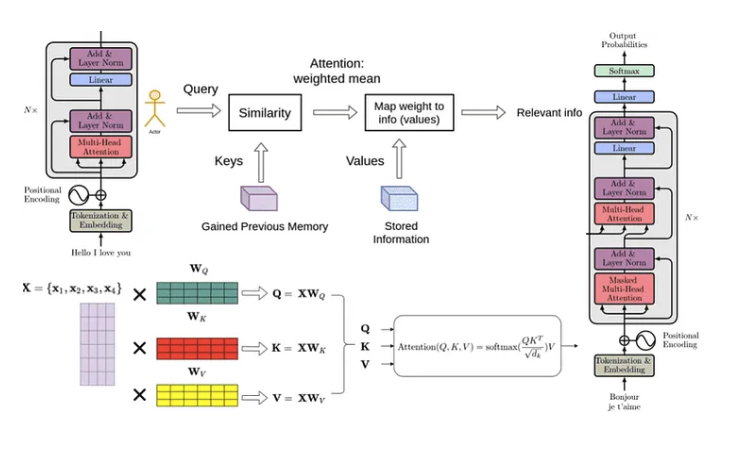
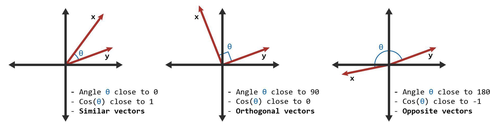
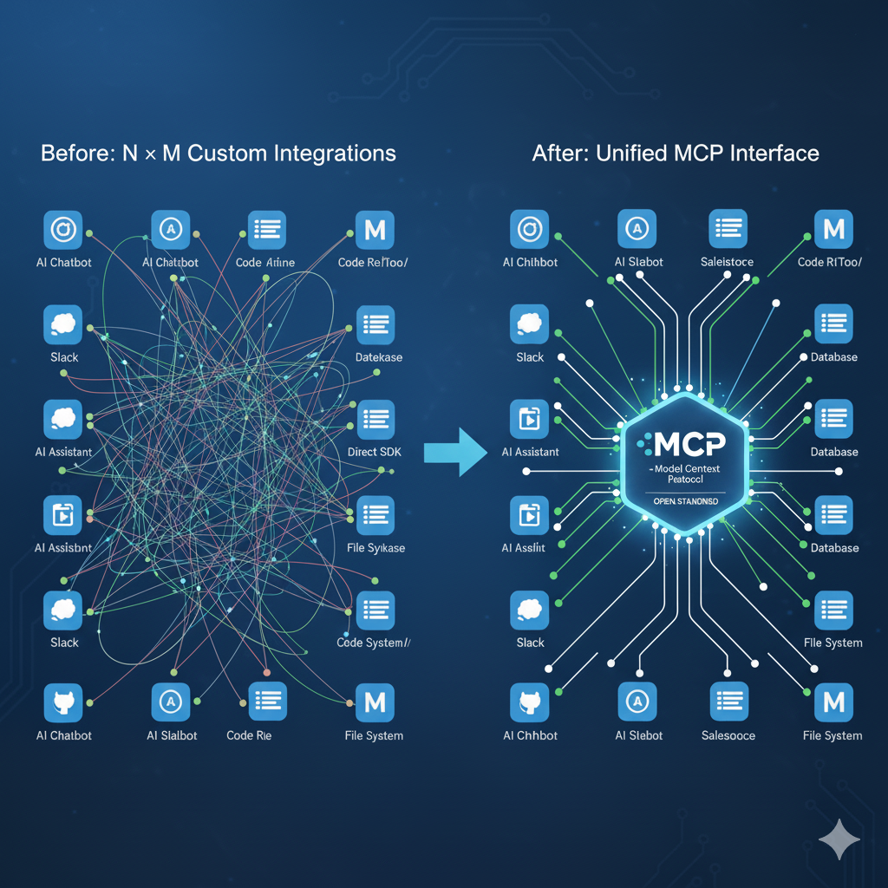

# AI 에이전트 시대의 실전 개발: RAG, Multi-Agent, MCP 정복하기

## 목차

- [RAG의 모든 것](#RAG의-모든-것)
  - [1. AI와 언어모델 기초 이해](#1-AI와-언어모델-기초-이해)
    - [1.1 NLP, Natural Language Processing(자연어 처리)란 무엇인가?](#11-NLP-Natural-Language-Processing자연어-처리란-무엇인가)
    - [1.2 NLP의 역사적 변천: 빈도수 기반에서 임베딩까지](#12-NLP의-역사적-변천-빈도수-기반에서-임베딩까지)
    - [1.3 NLP Preprocessing(전처리)](#13-NLP-Preprocessing전처리)
    - [1.4 NLP 주요 Task](#14-NLP-주요-Task)
    - [1.5 NLP 모델링 및 구조](#15-NLP-모델링-및-구조)
    - [1.6 NLP의 논쟁과 한계](#16-NLP의-논쟁과-한계)
    - [1.7 Transformer란 무엇인가?](#17-Transformer란-무엇인가)
    - [1.8 Transformer 구조](#18-Transformer-구조)
    - [1.9 BERT vs GPT: 구조적 차이와 학습 방식](#19-BERT-vs-GPT-구조적-차이와-학습-방식)
    - [1.10 차세대 아키텍처: Mamba와 트랜스포머의 미래](#110-차세대-아키텍처-Mamba와-트랜스포머의-미래)
    - [1.11 지식 증류(Knowledge Distillation)](#111-지식-증류Knowledge-Distillation)
    - [1.12 LLM(대규모 언어모델)의 주요 개념 정리](#112-LLM대규모-언어모델의-주요-개념-정리)
    - [1.13 프롬프트 엔지니어링 기초](#113-프롬프트-엔지니어링-기초)
    - [1.14 컨텍스트 엔지니어링과 정보 처리](#114-컨텍스트-엔지니어링과-정보-처리)
    - [1.15 LLM의 한계: Attention Decay(망각 현상)과 Hallucination(환각 현상)](#115-LLM의-한계-Attention-Decay망각-현상과-Hallucination환각-현상)
  - [2. 임베딩과 벡터 데이터베이스](#2-임베딩과-벡터-데이터베이스)
    - [2.1 Vector(벡터)란 무엇인가?](#21-Vector벡터란-무엇인가)
    - [2.2 임베딩의 원리와 활용](#22-임베딩의-원리와-활용)
    - [2.3 벡터 데이터베이스 구축](#23-벡터-데이터베이스-구축)
    - [2.4 청킹 전략: 데이터 처리의 핵심](#24-청킹-전략-데이터-처리의-핵심)
  - [3. RAG 시스템 설계와 구현](#3-RAG-시스템-설계와-구현)
    - [3.1 설계 기본](#31-설계-기본)
    - [3.2 RAG가 해결하는 LLM의 문제점](#32-RAG가-해결하는-LLM의-문제점)
    - [3.3 RAG 검색 최적화 기법](#33-RAG-검색-최적화-기법)
      - [3.3.1 하이브리드 검색](#331-하이브리드-검색-Hybrid-Search)
      - [3.3.2 Re-ranking(재정렬)](#332-Re-ranking-재정렬)
      - [3.3.3 Query Expansion(쿼리 확장)](#333-Query-Expansion-쿼리-확장)
      - [3.3.4 Multi-hop Reasoning(다단계 추론)](#334-Multi-hop-Reasoning-다단계-추론)
    - [3.4 RAG 성능 최적화 전략](#34-RAG-성능-최적화-전략)
    - [3.5 RAG의 현재와 미래: 다양한 접근법과 정답의 부재](#35-RAG의-현재와-미래-다양한-접근법과-정답의-부재)
- [에이전트의 모든 것](#에이전트의-모든-것)
  - [4. 단일 에이전트와 멀티 에이전트 시스템](#4-단일-에이전트와-멀티-에이전트-시스템)
    - [4.1 AI 에이전트 기초 개념](#41-AI-에이전트-기초-개념)
    - [4.2 단일 에이전트 시스템 구축](#42-단일-에이전트-시스템-구축)
    - [4.3 멀티 에이전트 시스템 아키텍처](#43-멀티-에이전트-시스템-아키텍처)
- [MCP의 모든 것](#MCP의-모든-것)
  - [5. MCP 활용](#5-MCP-활용)
    - [5.1 MCP(Model Context Protocol) 개요](#51-MCPModel-Context-Protocol-개요)
    - [5.2 MCP 설계 구성 요소 및 작동 방식](#52-MCP-설계-구성-요소-및-작동-방식)

---

## RAG의 모든 것

### 1. AI와 언어모델 기초 이해

#### 1.1 NLP, Natural Language Processing(자연어 처리)란 무엇인가?

NLP란 인간 언어(자연어)를 **컴퓨터가 이해하고 활용할 수 있도 만드는 기술**

- NLP의 두 가지 구성 요소
  - **NLU, Natural Language Understanding(이해): 문장의 의미를 해석**
  - **NLG, Natural Language Generation(생성): 컴퓨터가 새로운 문장을 생성**
- 예시: 사용자가 `"날씨 어때?"`라고 물으면
  - NLU는 `"날씨에 대한 질문"`임을 파악
  - NLG는 `"서울의 날씨는 맑고 28도 입니다"`라는 문장을 생성
- NLP vs 음성 인식
  - NLP는 "텍스트"를 중심으로 작동
  - 음성 인식은 "소리 -> 텍스트"로 변환하는 별도의 기술(Speech Recognition)

---

#### 1.2 NLP의 역사적 변천: 빈도수 기반에서 임베딩까지

현재의 딥러닝 기반 NLP를 이해하기 위해서는 과거의 전통적 방법론을 먼저 이해하는 것이 중요함.

##### 1.2.1 전통적인 빈도수 기반 모델(2010년대 이전)

딥러닝 이전, 텍스트를 숫자로 표현하는 주요 방법론은 단어의 빈도수와 통계적 중요도 기반.

**1) BoW(Bag-of-Words)**
- 문장에서 단어의 순서는 무시하고, 각 단어의 출현 빈도만 기록하여 벡터 생성
- 예시: "나는 사과를 좋아하고 너는 사과를 싫어한다."
  - → `{'나': 1, '사과': 2, '좋아하': 1, '너': 1, '싫어하': 1}`

**2) TF-IDF(Term Frequency-Inverse Document Frequency)**
- **TF(단어 빈도)**: 특정 문서에서 단어가 얼마나 자주 등장하는지
- **IDF(역문서 빈도)**: 전체 문서 집합에서 해당 단어가 얼마나 희귀한지
- **목표**: 단순 빈도뿐 아니라, 문서 분류나 정보 검색 시 해당 단어의 중요도를 측정
  - '이', '가', '는' 같은 흔한 불용어의 가중치는 낮추고, 핵심 키워드의 가중치는 높임
- **발전**: TF-IDF의 통계적 중요도 측정 아이디어는 훗날 **정보 검색 시스템**의 표준이 된 **BM25(Best Match 25)** 알고리즘의 기반이 되었음. (BM25는 문서 길이 정규화 및 TF 값 조정 등을 통해 성능을 개선)

**3) 통계적 모델**
- 이렇게 만들어진 빈도수/가중치 벡터를 입력으로 받아 다음과 같은 모델이 작동:
  - Naive Bayes, Logistic Regression, Support Vector Machine(SVM)
- 주요 활용: 스팸 필터링, 문서 분류 등

##### 1.2.2 빈도수 모델의 한계

구현이 간단하고 계산 속도가 빠르다는 장점이 있지만, 다음과 같은 치명적인 한계 존재.

| 한계점 | 설명 |
| --- | --- |
| **의미적 관계 파악 불가** | '고양이'와 '야옹이'는 의미가 유사하지만, 빈도수 벡터에서는 완전히 독립된 다른 단어로 처리됨. 단어의 유사성을 이해하지 못함. |
| **문맥 무시** | BoW는 단어의 순서를 무시하므로, "개가 사람을 물었다"와 "사람이 개를 물었다"를 거의 같은 문장으로 인식함. 순서가 중요한 문법적/의미적 차이를 잡아내지 못함. |
| **희소성 문제** | 전체 단어 수가 늘어 벡터의 차원이 기하급수적으로 커지고 대부분이 0으로 채워지는 희소 벡터(Sparse Vector) 문제 발생. 계산 비효율적. |

##### 1.2.3 딥러닝 시대의 시작(2010년대 중반)

이러한 한계를 극복하기 위해 등장한 것이 **딥러닝 기반의 임베딩(Word Embedding)** 기술.

**주요 임베딩 기법**
- **Word2Vec(2013)**: Google이 개발한 단어 임베딩 기법
  - CBOW(Continuous Bag of Words)와 Skip-gram 방식
  - 주변 단어를 통해 의미적 유사성을 학습
  - 예: `king - man + woman ≈ queen`(벡터 연산으로 의미 관계 표현 가능)

- **GloVe(2014)**: Stanford에서 개발한 글로벌 벡터 표현
  - 전체 말뭉치의 통계 정보를 활용한 임베딩

**임베딩의 혁신**
- **밀집 벡터(Dense Vector)** 사용: 희소 벡터 문제 해결
- **의미적 유사성** 표현: 비슷한 의미의 단어는 벡터 공간에서 가까이 위치
- **전이 학습** 가능: 대규모 말뭉치로 학습한 임베딩을 다양한 Task에 재사용

##### 1.2.4 현대 NLP: Transformer와 대규모 언어모델

2017년 **Transformer** 등장 이후, NLP는 완전히 새로운 차원으로 진화.

- **문맥 의존적 임베딩**: Word2Vec과 달리, 같은 단어라도 문맥에 따라 다른 벡터 표현
  - 예: "은행(bank)"이 "강둑"과 "금융기관" 중 어느 의미인지 문맥으로 판단
- **Self-Attention 메커니즘**: 문장 내 모든 단어 간의 관계를 동시에 파악
- **대규모 사전학습**: 방대한 텍스트로 학습 후, 특정 Task에 Fine-tuning
- **대표 모델**: BERT, GPT, Claude, Gemini 등

**정리: NLP의 진화**
```
2010년 이전: 빈도수 기반(BoW, TF-IDF) + 통계 모델
    ↓
2013-2017: 임베딩 시대(Word2Vec, GloVe) + RNN/LSTM
    ↓
2017-현재: Transformer 시대(BERT, GPT, LLM)
```

---

#### 1.3 NLP Preprocessing(전처리)

- 주요 전처리 기법
  - Tokenization(토큰화): 문장을 **단어/문장/음절 단위로 나눔**
  - Stopword Removal(불용어 제거): **의미 없는 자주 쓰이는 단어 제거**
  - Lemmatization(표제어화) vs Stemming(어간 추출): 단어의 기본형 찾기
    - 예를 들어 `am`, `are`, `is`는 서로 다른 스펠링이지만 그 뿌리 단어는 `be`라고 볼 수 있고 `be`는 표제어
    - 어간 추출은 정해진 규칙만 보고 단어의 어미를 자르는 어림짐작의 작업, `formalize -> formal`, `allowance -> allow`
  - Sentence Segmentation(문장 분리)

##### 한국어 NLP의 특수한 어려움

한국어는 영어와는 근본적으로 다른 언어 구조를 가지고 있어, NLP 처리 시 추가적인 복잡성이 발생합니다.

**1) 교착어(Agglutinative Language) vs 고립어(Isolating Language)**
- **영어(고립어적 특성)**
  - 단어가 독립적으로 존재하며, 단어 자체가 하나의 의미 단위
  - 예: "eat", "eats", "ate", "eating" - 어간 변화가 제한적
  - 토큰화: 띄어쓰기만으로도 의미 단위 분리 가능

- **한국어(교착어)**
  - 어간 + 조사/어미가 결합하여 하나의 단어 형성
  - 예: "먹다" → "먹는다", "먹었다", "먹을까", "먹자", "먹고", "먹으니", "먹어서" 등 무수히 많은 변형
  - 문제: 띄어쓰기만으로는 의미 단위 분리 불가능

**2) 조사 시스템의 복잡성**
- **영어**: 전치사가 독립된 단어로 분리
  - "to the store", "at the store" - 띄어쓰기로 자연스럽게 분리됨

- **한국어**: 조사가 명사에 붙어서 하나의 어절이 됨
  - "가게에", "가게로", "가게는", "가게가", "가게만" - 모두 다른 토큰이 됨
  - 같은 명사 "가게"를 찾으려면 조사를 분리하는 **형태소 분석**이 필수
  - 예: "사과를 먹었다" vs "I ate an apple"
    - 영어: "apple"은 독립된 토큰
    - 한국어: "사과를"을 "사과" + "를"로 분해해야 "사과"라는 개념 추출 가능

**3) 띄어쓰기 모호성과 일관성 문제**
- **영어**: 띄어쓰기 규칙이 명확하고 일관적
  - "I cannot do it" - 띄어쓰기가 거의 고정

- **한국어**: 띄어쓰기 규칙이 복잡하고, 실제 사용에서 불일치 빈번
  - 맞춤법: "그렇지 않다" vs 실제 사용: "그렇지않다"
  - "할 수 있다" vs "할수있다"
  - 보조용언: "먹어 버렸다" vs "먹어버렸다" - 둘 다 사용됨
  - 사용자 입력 데이터는 띄어쓰기 오류 투성이 → 전처리 난이도 증가

**4) 어순과 조사 생략**
- **영어**: 어순(SVO)이 의미를 결정, 생략 불가
  - "The dog bit the man" ≠ "The man bit the dog"(어순 변경 = 의미 변경)

- **한국어**: 조사가 의미를 결정, 어순 자유롭고 생략도 가능
  - "개가 사람을 물었다" = "사람을 개가 물었다"(어순 바뀌어도 조사로 의미 파악)
  - 구어: "나 밥 먹었어"(조사 생략) vs 문어: "나는 밥을 먹었다"
  - 문제: 조사 생략 시 의미 파악을 위해 문맥 의존도가 매우 높아짐

**5) 복합 명사와 합성어**
- **영어**: 복합어를 띄어쓰기로 분리하는 경우가 많음
  - "deep learning", "natural language processing"

- **한국어**: 복합 명사를 붙여 씀
  - "자연어처리", "딥러닝모델", "인공지능기술"
  - 문제: "자연어처리기술개발" 같은 긴 복합명사는 어디까지가 하나의 단위인지 파악 어려움
  - 예: "자연어 / 처리 / 기술 / 개발" vs "자연어처리 / 기술개발" - 분석 결과가 달라질 수 있음

**왜 한국어 NLP가 더 어려운가?**
- 영어: **띄어쓰기 = 의미 단위** → 간단한 토큰화로 해결
- 한국어: **형태소 분석 필수** → 어간/어미/조사 분리 + 띄어쓰기 보정 + 문맥 이해 모두 필요

---

##### 형태소 분석(Morphological Analysis)이란?

**형태소(Morpheme)**: 의미를 가진 최소 단위

- **영어 예시**: "unhappiness"
  - un-(접두사: 부정) + happy(어간: 행복한) + -ness(접미사: 명사형)
  - 형태소 분석: ["un", "happy", "ness"]

- **한국어 예시**: "아름다웠습니다"
  - 아름답(어간) + 었(과거형 어미) + 습니다(종결 어미)
  - 형태소 분석: ["아름답", "었", "습니다"]

**형태소 분석의 역할**
1. **어절을 의미 단위로 분해**: "사과를" → ["사과", "를"]
2. **품사 태깅(POS Tagging)**: 각 형태소의 품사 정보 부여
   - "사과를" → [("사과", "명사"),("를", "조사")]
3. **어간 추출**: 다양한 변형에서 기본형 찾기
   - "먹었다", "먹는다", "먹자" → 모두 어간 "먹"으로 추출

**왜 필요한가?**
- 영어: 띄어쓰기만으로도 대부분 의미 단위 분리 가능
- 한국어: 조사/어미가 붙어있어 형태소 분석 없이는 정확한 의미 파악 불가

**예시: 검색 시스템**
- 사용자 검색어: "사과를 먹었다"
- 형태소 분석 전: ["사과를", "먹었다"] → "사과" 검색 실패
- 형태소 분석 후: ["사과", "를", "먹", "었", "다"] → "사과" 정확히 검색 가능

---

#### 1.4 NLP 주요 Task

| Task        | 설명              | 활용 예시        |
| ----------- | ----------------- | ---------------- |
| 감정 분석   | 긍정/부정 분류    | 리뷰, 트윗       |
| 번역        | 한->영, 영->한 등 | Google Translate |
| 요약        | 긴 문서를 짧게    | 뉴스 요약        |
| 개체명 인식 | 이름, 장소 추출   | 기사 분석        |
| 질의응답    | 질문에 답변 생성  | 챗봇             |
| 자동 완성   | 입력 중 예측      | 검색엔진, IDE    |
| 정보 검색   | 관련 문서 찾기    | 구글 검색        |

---

#### 1.5 NLP 모델링 및 구조

- 전통 모델
  - Naive Bayes, Logistic Regression, Decision Tree
  - HMM(Part-of-Speech Tagging)
- 딥러닝 모델
  - **RNN, LSTM**, GRU: 시퀀스 처리
  - CNN: 문장 분류
  - **Autoencoder** / Seq2Seq: 번역, 요약 등
  - **Transformer**: 현재 NLP 모델의 중심 구조
    - Self-Attention으로 병렬 처리 가능
    - 장거리 의존성 문제 해결
    - 대표 아키텍처: BERT(인코더), GPT(디코더)

---

#### 1.6 NLP의 논쟁과 한계

- **데이터 편향 문제 (Bias Issue)**
    - 사회적 편견(성별, 인종)이 학습 데이터에 반영되어 **차별적** 결과를 도출함.
    - 모델 사용 시 공정성(Fairness)과 윤리적(Ethical) 문제가 발생.

- **설명 가능성 부족 (Explainability Gap)**
    - **Black-box** 모델의 판단 근거가 불분명하여 **결과를 신뢰하기 어려움**.
    - 특히 **Transformer**와 같은 복잡한 딥러닝 모델에서 두드러지는 한계.

---

#### 1.7 Transformer란 무엇인가?

##### Transformer 이전: RNN/LSTM의 한계

```
[기존 방식: RNN/LSTM]
입력: "나는 사과를 좋아한다"

처리 방식: 나는 → 사과를 → 좋아한다(순차 처리)
           ↓      ↓        ↓
문제점 1: 느림(병렬 처리 불가)
문제점 2: 앞 단어 기억 못함(장기 의존성 문제)
```

##### Transformer의 핵심 아이디어: "한 번에 전체를 본다"
```
[Transformer 방식]
입력: "나는 사과를 좋아한다"

처리 방식: 4개 단어를 동시에 처리!
           나는 ←→ 사과를 ←→ 좋아한다
           (모든 단어가 서로를 본다)
           
장점 1: 빠름(병렬 처리 가능)
장점 2: 문맥 파악 정확(전체를 한눈에)
```

##### 모델 구성
- Transformer는 여러 개의 Transformer Block이 순차적으로 연결되어 구성
- 각 Block은 크게 **Attention Component와 Feed-forward Network로 나뉨**

##### 데이터 흐름
```
Positional Encoding → Multi-Head Attention → Feed-Forward Network
```

##### Positional Encoding: 순서 정보 추가
- Transformer는 **순차 정보가 없기 때문에, sin/cos positional encoding을 통해 토큰의 순서를 Embedding 벡터에 더함**
- 이는 각 Transformer Block에 들어가는 입력에 포함되는 전처리 단계

##### Multi-Head Attention: 여러 관점에서 보기

**핵심 개념**:
- **문맥 이해를 위해 각 단어가 문장 내 다른 단어와의 관계를 파악**
- **Scaled dot-product 방식을 사용해, softmax를 통해 중요도 가중치를 계산**
- 여러 개의 헤드로 병렬 처리하며, 문법, 의미, 위치 관계를 동시에 파악

**비유와 예시**:
```
같은 문장을 3명이 동시에 분석:

헤드1: 문법 관계 파악 (주어-동사)
헤드2: 의미 관계 파악 (은행-돈)
헤드3: 위치 관계 파악 (가까운 단어)

→ 3명의 의견 종합 → 더 정확한 이해!

실제 GPT-3: 96개 헤드가 동시에 분석
```

**실무 예시**:
- 예: "bank"는 "river"와 "money"를 문맥에 따라 다른 의미를 갖게 됨

##### Feed-Forward Network: 정보 재가공

**핵심 개념**:
- attention 출력을 각 위치마다 추가 처리를 하는 MLP 구조
- 일반적으로 hidden 크기는 embedding 크기의 4배로 설정

**비유**: 재료를 더 풍부하게 만드는 과정

```
[과정]
입력 정보(768차원)
    ↓ 확장
중간 처리(3072차원) ← 4배 확장!
    ↓ 압축
출력 정보(768차원)

왜?: 정보를 확장했다 압축하면서 
     더 풍부한 의미 표현 생성
```

**실무 팁**: 
- 보통 임베딩 크기의 4배로 확장(768 → 3072)
- 왜 4배? → 실험적으로 가장 성능 좋았음
- 각 단어(토큰)마다 독립적으로 처리됨

##### Encoder-Decoder 구조
- **Encoder**: 여러 Block 쌓아 입력 토큰 전체의 문맥적 표현 생성
- **Decoder**:
  - 마스크된 self-attention을 사용해 이전 출력 토큰만 참조
  - encoder 출력과 cross-attention을 수행하여 각 단계 예측에 활용

##### 안정적 학습을 위한 안전장치

###### Residual Connection(지름길)

**문제**:
```
Block 1 → Block 2 → ... → Block 12
          ↓ 정보가 점점 손실됨
```

**해결**:
```
Block 1 ──→ Block 2 ──→ Block 12
  └─────────┴──────────┘
        (지름길 추가)

→ 원본 정보도 같이 전달!
→ 정보 손실 방지
```

###### Layer Normalization(값 조정)

**문제**:
```
Block 통과할수록 값이 너무 커지거나 작아짐
→ 학습 불안정
→ Gradient 폭발/소실
```

**해결**:
```
매 Block마다 값의 범위를 일정하게 조정
→ 안정적 학습 가능
→ 깊은 모델도 학습 가능
```

**실무 노하우**:
- **Post-LN**(초기 방식): Block 처리 → Normalization
- **Pre-LN**(요즘 방식): Normalization → Block 처리 ← GPT-3, PaLM 사용
- Pre-LN이 큰 모델에서 훨씬 안정적!

- 각 서브레이어(attention -> feed-forward) 후, residual 연결 + LayerNorm을 적용
- 초기 Transformer는 post-LN을 사용했지만, 이후 pre-LN 방식이 더 안정적으로 사용

- 본 구조는 BERT, GPT, Claude, Gemini 등 수많은 모델의 기반이 됨

---

#### 1.8 Transformer 구조: 실전에서 어떻게 작동하는가?

##### Transformer 구조를 그림으로 이해하기



위 그림은 Transformer의 전체 구조를 보여줍니다. 왼쪽은 **Encoder(문장 이해)**, 중앙은 **Attention(단어 간 관계 파악)**, 오른쪽은 **Decoder(답변 생성)**를 나타냅니다. 각 부분을 단계별로 살펴보겠습니다.

##### 왼쪽: Encoder - "문장을 이해하는 엔진"

**비유**: 책을 읽을 때 단어 하나만 보지 않고, 문장 전체를 보면서 맥락을 파악하는 것과 같습니다.

**입력 처리 과정**
1. **문장 입력**: `"Hello I love you"` 같은 문장이 들어옴
2. **Tokenization & Embedding**: 단어를 숫자 벡터로 변환
3. **Positional Encoding**: "순서 정보"를 추가 (첫 번째 단어인지, 세 번째 단어인지)
   - 왜 필요할까? Transformer는 병렬 처리하기 때문에 단어 순서를 따로 알려줘야 함

**Encoder Layer(N번 반복)**
- **Multi-Head Attention**: 문장 내 단어들 간의 관계를 학습
  - 예: "I love you"에서 "love"는 "I"와 "you"를 모두 참조해야 의미 파악 가능
- **Add & Layer Norm**: 안정적인 학습을 위한 정규화
- **Feed-forward**: 각 단어를 개별적으로 변환하여 더 풍부한 표현으로 만듦

##### 중앙: Attention 메커니즘 - "중요한 단어에 집중하는 방법"

**쉬운 비유**:
- **나쁜 독해**: 모든 단어를 똑같이 중요하게 읽음 → 핵심을 놓침
- **좋은 독해**: 중요한 단어에 집중하면서 읽음 → Attention이 하는 일!

**입력 벡터**
- X = {x₁, x₂, x₃, x₄}: 각 단어의 임베딩 벡터

**세 가지 핵심 행렬**
- **Q (Query)**: "나는 어떤 정보가 필요해?" (질문하는 단어)
- **K (Key)**: "나는 이런 정보를 가지고 있어" (답변할 수 있는 단어)
- **V (Value)**: "내가 줄 수 있는 실제 정보" (전달할 내용)

**Scaled Dot-Product Attention 연산**

수식: $Attention(Q, K, V) = \text{softmax}\left(\frac{QK^T}{\sqrt{d_k}}\right)V$

**쉽게 풀어보면:**
1. **Query와 Key 비교**: "어떤 단어가 나와 관련 있을까?" 계산
2. **Scaling**: 차원이 클 때 값이 너무 커지는 것을 방지 ($\sqrt{d_k}$로 나눔)
   - 왜? 너무 큰 값은 Softmax를 극단적으로 만들어 학습이 불안정해짐
3. **Softmax**: 확률 분포로 변환 → "각 단어를 얼마나 참조할지" 결정
4. **Value와 곱하기**: 중요한 단어의 정보를 더 많이 가져옴

**실전 계산 예시**

"I love programming"에서 "love"가 어떤 단어에 집중할까?

| Query | Key          | 유사도(Q*K) | Scaled (√64=8) | Softmax | 최종 출력      |
|-------|--------------|-------------|----------------|---------|----------------|
| love  | I            | 10          | 1.25           | 0.5     | V_I * 0.5      |
| love  | programming  | 8           | 1.0            | 0.4     | V_prog * 0.4   |
| love  | love         | 2           | 0.25           | 0.1     | V_love * 0.1   |

결과: "love"는 "I"와 "programming"을 주로 참조하며 문맥을 파악

**왜 이렇게 복잡하게 만들었을까?**
- 단순히 단어만 보면 "love"의 의미를 알 수 없음
- 주변 단어(I, programming)를 보면 "좋아한다"는 의미임을 알 수 있음
- Attention은 이런 **문맥 파악을 자동화**한 메커니즘

##### 오른쪽: Decoder - "답변을 생성하는 엔진"

**비유**: 번역기가 한국어를 보고(Encoder) 영어를 만들어내는(Decoder) 과정

**입력 처리**
- 예: 번역 문장 `"Bonjour je t'aime"` (프랑스어)
- Tokenization & Embedding + Positional Encoding 적용

**Decoder Layer(N번 반복)**
1. **Masked Multi-Head Attention**:
   - "이전 단어까지만" 참조 가능 (미래 단어는 가림)
   - 왜? 번역/생성할 때는 아직 만들지 않은 단어를 볼 수 없으니까

2. **Multi-Head Attention (Cross-Attention)**:
   - Encoder의 출력을 참조
   - "원문(프랑스어)의 어느 부분을 번역해야 할까?" 판단

3. **Feed-forward & Layer Norm**: 최종 변환

**최종 출력**
- `Linear → Softmax`를 통해 다음 단어 예측
- 예: "Hello" → "I" → "love" → "you" 순차 생성

**실전에서 Decoder가 하는 일**
```text
입력(프랑스어): "Bonjour je t'aime"
↓
Decoder 작동:
1단계: "Hello" 생성 (Bonjour를 참조)
2단계: "I" 생성 (je를 참조)
3단계: "love" 생성 (t'aime를 참조)
4단계: "you" 생성 (문맥 종합)
↓
출력(영어): "Hello I love you"
```

**Transformer의 혁신 요약**
- **병렬 처리**: 모든 단어를 동시에 처리 → 빠름
- **장기 의존성**: 멀리 떨어진 단어도 관계 파악 가능
- **유연성**: Encoder만 쓰면 BERT, Decoder만 쓰면 GPT

---

#### 1.9 BERT vs GPT: 구조적 차이와 학습 방식

##### BERT와 GPT의 핵심 차이점

| 특징 | BERT | GPT |
|------|------|-----|
| **아키텍처** | Encoder-only | Decoder-only |
| **방향성** | 양방향(Bidirectional) | 단방향(Unidirectional) |
| **학습 방식** | Masked Language Modeling | Next Token Prediction |
| **주요 용도** | 이해(Understanding) | 생성(Generation) |
| **Attention** | Self-attention(양방향) | Masked self-attention(단방향) |
| **문맥 접근** | 전체 문장 동시 접근 | 이전 토큰만 접근(하지만 이미 생성된 토큰들은 병렬 처리) |

##### 학습 방식의 차이

- **BERT의 Masked Language Modeling**
  - 문장에서 일부 토큰을 `[MASK]`로 가리고 원래 토큰을 예측
  - 예: `"나는 [MASK]를 좋아한다"` → `"나는 [사과]를 좋아한다"`
  - **장점**: 전체 문맥을 동시에 학습하여 문맥 이해가 뛰어남
  - **단점**: 생성 태스크에는 부적합

- **GPT의 Next Token Prediction**
  - 이전 토큰들을 보고 다음 토큰을 예측
  - 예: `"나는 사과를"` → `"좋아한다"`
  - **장점**: 자연스러운 텍스트 생성 가능
  - **단점**: 문맥 이해가 제한적

##### BERT 계열 모델들의 진화

- **RoBERTa(Robustly Optimized BERT)**
  - BERT의 학습 방법을 개선한 모델
  - 더 큰 배치 크기, 더 긴 학습, 정적 마스킹 적용
  - **성능**: BERT보다 2-20% 성능 향상

- **ALBERT(A Lite BERT)**
  - 파라미터 공유를 통해 모델 크기 대폭 감소
  - **효율성**: BERT-Large와 비슷한 성능, 18배 적은 파라미터
  - **특징**: 메모리 사용량 대폭 감소

- **ELECTRA(Efficiently Learning an Encoder)**
  - Generator-Discriminator 구조로 효율성 향상
  - **학습**: 실제 토큰 vs 생성된 토큰 구분 학습
  - **성능**: 같은 성능을 더 적은 계산으로 달성

##### 한국어 특화 BERT 모델들

- **KoBERT**: 한국어 코퍼스로 학습된 BERT
- **KcBERT**: 한국어 댓글 데이터로 학습, 비격식체에 특화
- **KorBERT**: 다양한 한국어 도메인 데이터로 학습

---

#### 1.10 차세대 아키텍처: Mamba와 트랜스포머의 미래

##### Mamba의 등장 배경

- **트랜스포머의 한계**
  - Attention 메커니즘의 O(n²) 복잡도
  - 긴 시퀀스에서의 메모리 사용량 폭증
  - 순차적 처리의 병목 현상
  - **U자형 망각현상**: 긴 컨텍스트에서 중간 부분 정보 손실
  - **Lost in the Middle**: 컨텍스트 중간이 가장 먼저 망각되는 현상

- **Mamba의 혁신**
  - **선형 복잡도**: O(n)으로 계산 복잡도 대폭 감소
  - **상태 공간 모델**: Selective State Space Model 기반
  - **긴 시퀀스**: 수십만 토큰까지 효율적 처리 가능
  - **U자형 망각현상 해결**: Attention Decay 문제를 근본적으로 개선

##### Mamba의 구체적인 개선 사례

- **U자형 망각현상 해결**
  - **트랜스포머의 문제**: 긴 컨텍스트에서 시작/끝 부분은 잘 기억하지만 중간 부분이 망각되는 U자형 패턴
  - **Mamba의 해결**: 상태 공간 모델을 통해 모든 위치의 정보를 동등하게 처리
  - **실제 성능**: 100만 토큰 길이에서도 일관된 성능 유지

- **Lost in the Middle 현상 개선**
  - **트랜스포머**: 컨텍스트 중간 부분이 가장 먼저 망각되는 현상
  - **Mamba**: 순차적 상태 업데이트로 모든 정보를 균등하게 보존
  - **검증 결과**: 긴 문서에서 중간 부분 정보도 정확하게 활용

- **메모리 효율성**
  - **트랜스포머**: 모든 토큰 쌍에 대한 Attention 계산으로 메모리 폭증
  - **Mamba**: 상태 공간 모델로 메모리 사용량이 선형적으로 증가
  - **실제 비교**: 100K 토큰에서 트랜스포머 대비 10배 적은 메모리 사용

- **성능 벤치마크 결과**
  - **긴 시퀀스 처리**: 1M 토큰에서도 일관된 성능 유지
  - **추론 속도**: 동일한 성능에서 3-5배 빠른 추론
  - **메모리 효율성**: 긴 시퀀스에서 트랜스포머 대비 90% 메모리 절약
  - **정확도**: 긴 문서 QA 태스크에서 트랜스포머와 동등하거나 우수한 성능

##### Mamba vs Transformer 비교

| 특징 | Transformer | Mamba |
|------|-------------|-------|
| **복잡도** | O(n²) | O(n) |
| **메모리** | 긴 시퀀스에서 폭증 | 선형적 증가 |
| **병렬화** | 높음 | 제한적 |
| **긴 시퀀스** | 제한적 | 우수 |
| **U자형 망각현상** | 심각함 | 해결됨 |
| **하드웨어 최적화** | 잘 되어있음 | 아직 초기 단계 |

##### 하드웨어 생태계의 현실

- **현재 상황**
  - GPU, TPU 등이 트랜스포머에 최적화되어 있음
  - CUDA, TensorRT 등 소프트웨어 스택이 트랜스포머 중심
  - 대부분의 AI 칩셋이 Attention 메커니즘에 특화

- **Mamba의 도전**
  - 새로운 하드웨어 아키텍처 필요
  - 소프트웨어 생태계 구축 시간 필요
  - 기존 인프라 투자 보호 문제

##### 미래 전망: 현실적 관점

- **현재 트랜스포머 생태계의 강력함**
  - **거대한 투자 규모**: GPT, Claude, Gemini 등 수조원 규모의 모델과 인프라
  - **완성된 생태계**: 하드웨어(GPU/TPU), 소프트웨어(CUDA/TensorRT), 데이터, 인재
  - **검증된 성능**: 다양한 태스크에서 이미 우수한 성능 달성
  - **사용자 기반**: 수억 명의 사용자가 이미 트랜스포머 기반 서비스 사용 중

- **단기(1-2년): 점진적 공존**
  - **트랜스포머 지배 지속**: 기존 모델들의 압도적 시장 점유율 유지
  - **Mamba의 틈새 진입**: 특정 도메인(긴 시퀀스 처리, 메모리 제약 환경)에서만 제한적 도입
  - **하이브리드 접근**: 일부 서비스에서 Transformer + Mamba 조합 실험
  - **연구 중심**: 주로 학술 연구와 특수 목적 애플리케이션에서 활용

- **중기(3-5년): 선택적 도입**
  - **도메인별 분화**: 긴 문서 처리, 실시간 스트리밍 등 특정 용도에서 Mamba 채택 증가
  - **하드웨어 생태계 변화**: Mamba 최적화 칩셋 등장하지만 트랜스포머 대체는 어려움
  - **기업별 전략 차이**: 메모리/비용 민감 기업은 Mamba, 성능 우선 기업은 트랜스포머
  - **점진적 마이그레이션**: 새로운 프로젝트에서만 Mamba 도입, 기존 시스템은 유지

- **장기(5년+): 공존과 특화**
  - **완전 대체는 불가능**: 트랜스포머의 범용성과 성숙도로 인해 완전 대체 어려움
  - **도메인 특화**: 각 아키텍처가 최적화된 영역에서 지속적 사용
  - **멀티 아키텍처 시대**: 프로젝트 요구사항에 따라 적절한 아키텍처 선택
  - **지속적 혁신**: 두 아키텍처 모두 지속적 개선과 최적화 진행

- **현실적 제약사항**
  - **기존 투자 보호**: 수조원 규모의 기존 인프라와 모델 보호 필요
  - **학습 곡선**: 새로운 아키텍처에 대한 개발자와 엔지니어 교육 시간 필요
  - **성능 검증**: 실제 프로덕션 환경에서의 안정성과 성능 검증 기간 필요
  - **비용 효율성**: 새로운 아키텍처 도입의 ROI(투자 수익률) 검증 필요

- **결론: 혁신과 현실의 균형**
  - Mamba는 **트랜스포머의 완전한 대체재가 아닌 보완재**
  - **상황에 맞는 선택**: 프로젝트 요구사항에 따라 적절한 아키텍처 선택
  - **지속적 관찰**: 기술 발전과 시장 변화를 지속적으로 모니터링
  - **실용적 접근**: 이론적 우수성보다 실제 비즈니스 가치에 중점

---

#### 1.11 지식 증류(Knowledge Distillation): 선생님의 지식을 학생에게 전달하기

##### 지식 증류란? - 쉬운 비유로 이해하기

- **일상 비유**: 경험이 많은 선생님이 신입 선생님에게 노하우를 전수하는 것
  - **선생님(Teacher)**: 경험이 많고 실력이 뛰어난 베테랑(GPT-4, Claude-3 등)
  - **학생(Student)**: 아직 경험이 부족하지만 빠르게 배우려는 신입(GPT-4.0-mini, 작은 모델)
  - **목적**: 선생님의 실력은 유지하면서, 학생이 더 빠르고 효율적으로 일할 수 있게 하기

- **왜 필요한가?**
  - **비용 문제**: 대규모 모델(GPT-4 등)의 높은 추론 비용을 절감
  - **속도 문제**: 실시간 응답이 필수적인 서비스의 지연 시간 단축
  - **배포 문제**: 모바일/엣지 컴퓨팅 환경 등 제한적 자원에 배포 가능

##### 지식 증류의 원리 - 어떻게 지식을 전달할까?

- **단순한 답 vs 상세한 설명**
  - **Hard Target(하드 타겟)**: "이 문제의 정답은 A입니다"(0 또는 1)
  - **Soft Target(소프트 타겟)**: "A가 60% 확률로 맞고, B는 20%, C는 15%..."(확률 분포)
  - **왜 상세한 설명이 좋을까?**: 학생이 "왜 A가 맞는지", "다른 선택지도 고려해봤는지"를 알 수 있음

- **Temperature Scaling(온도 스케일링)**
  - Softmax 함수에 온도 파라미터 T를 적용하는 기법
  - T가 높을수록 분포가 부드러워짐(더 다양한 선택지 고려)
  - 예: `softmax(logits/T)` - 수식으로는 이렇게 표현
  - **쉬운 비유**: 선생님이 "이 정도로 확신해?"라고 물어보는 것

- **실생활 예시**
  - **나쁜 선생님**: "이 문제 답은 3번이야"(단순 암기)
  - **좋은 선생님**: "3번이 가장 맞지만, 1번도 비슷한 이유로 고려해볼 만하고, 2번은 이런 점에서 틀렸어" (이유와 과정 설명)

##### 지식 증류 과정 - 단계별로 따라하기

1. **Teacher 모델 학습(선생님 모델 만들기)**
   - 엄청난 데이터로 거대한 모델을 학습
   - 예: GPT-4는 수조 개의 텍스트로 학습됨
   - 결과: 모든 질문에 대해 정확하고 상세한 답변 가능

2. **Student 모델 설계(학생 모델 설계하기)**
   - Teacher보다 훨씬 작고 가벼운 모델 만들기
   - 예: GPT-4 → GPT-3.5, BERT-Large → BERT-Base
   - 목표: 선생님의 90% 성능을 10% 크기로 달성

3. **지식 전달(Knowledge Transfer)**
   - Teacher의 출력을 Student의 학습 목표로 사용
   - 단순한 정답이 아닌, Teacher의 사고 과정까지 전달
   - **Loss Function**: `Loss = α × Hard Loss + β × Soft Loss`
   - 결과: 작은 모델이 큰 모델처럼 생각하게 됨

##### 지식 증류의 종류Knowledge Distillation Types)

- **Response-based Distillation(응답 기반 증류)**
  - Teacher의 최종 출력만 사용하는 가장 기본적인 방법
  - 가장 간단하고 널리 사용됨
  - **예시**: GPT-4의 답변을 GPT-3.5가 학습

- **Feature-based Distillation(특징 기반 증류)**
  - 중간 레이어의 특징(feature)도 함께 활용
  - 더 풍부한 지식 전달 가능
  - **예시**: BERT의 중간 레이어 정보까지 전달

- **Attention-based Distillation(어텐션 기반 증류)**
  - Attention 패턴을 전달하는 방법
  - 특히 Transformer 모델에서 효과적
  - **예시**: 어떤 부분에 집중해야 하는지까지 학습

##### 실제 적용 사례 - 우리가 사용하는 서비스들

- **ChatGPT의 경우**
  - **GPT-4**: Teacher 역할, 정확하지만 비싸고 느림
  - **GPT-3.5**: Student 역할, GPT-4의 지식을 받아서 빠르고 저렴하게 서비스
  - **결과**: 대부분의 사용자는 GPT-3.5로도 충분한 만족

- **BERT → DistilBERT(Distilled BERT)**
  - **파라미터**: 40% 감소(110M → 66M)
  - **속도**: 60% 향상
  - **성능**: 97% 유지
  - **용도**: 모바일, 임베디드 환경에서의 자연어 처리

- **음성 인식**
  - **서버용**: 정확한 음성 인식 모델
  - **모바일용**: 작지만 빠른 모델(지식 증류로 학습)

##### 지식 증류의 장단점

- **장점**
  - **비용 절약**: 큰 모델 대신 작은 모델 사용으로 비용 대폭 절약
  - **속도 향상**: 빠른 응답으로 사용자 경험 개선
  - **배포 용이**: 모바일, IoT 등 제한된 환경에서도 사용 가능
  - **에너지 효율**: 전력 소모량 감소로 환경 친화적

- **단점**
  - **성능 손실**: 완벽하게 같지는 않음(보통 90-95% 수준)
  - **학습 비용**: 선생님 모델이 필요해서 초기 비용 발생
  - **복잡성**: 단순한 학습보다 복잡한 과정 필요

##### 언제 지식 증류를 사용할까?

- **사용하면 좋은 경우**
  - 비용을 줄이고 싶을 때
  - 빠른 응답이 필요할 때
  - 모바일이나 작은 서버에 배포할 때
  - 에너지 효율이 중요할 때

- **사용하지 않는 것이 좋은 경우**
  - 최고 성능이 절대적으로 필요할 때
  - 학습할 선생님 모델이 없을 때
  - 단순한 작업이라 작은 모델로도 충분할 때

---

#### 1.12 LLM(대규모 언어모델)의 주요 개념 정리

##### Pre-training vs Fine-tuning: 학교 교육과 직업 훈련

**쉬운 비유**
- **Pre-training(사전 학습)**: 초등학교부터 대학까지의 일반 교육
  - 국어, 수학, 과학 등 기본기를 두루두루 배움
  - 특정 직업은 정해지지 않았지만, 폭넓은 지식 습득

- **Fine-tuning(미세 조정)**: 특정 직업을 위한 전문 교육
  - 의사가 되려면 의대, 변호사가 되려면 로스쿨
  - 이미 배운 기본기를 바탕으로 전문 영역 집중 학습

**Pre-training(사전 학습)**
- **목적**: 언어의 일반적인 구조와 문맥을 이해하도록 학습
- **데이터**: 대규모 말뭉치(웹 텍스트, 위키백과, 책, 뉴스 등)
- **방식**: 다음 단어 예측 또는 빈칸 채우기(Masked Language Modeling)
  - 예: "나는 ___를 좋아한다" → 모델이 "사과", "음악", "여행" 등을 예측
- **특징**:
  - 도메인에 구애받지 않고 넓은 범용성을 갖춤
  - 일반적인 언어 감각, 문법, 개념 구조를 파악
- **실제 예시**: GPT는 인터넷 전체 텍스트로 pre-training되어 다양한 주제를 이해함

**Fine-tuning(미세 조정)**
- **목적**: 사전 학습된 모델을 특정 Task나 도메인에 최적화
- **데이터**: 소량의 라벨이 붙은 전문 데이터
- **방식**:
  - **Supervised Fine-tuning(SFT)**: 정답이 있는 데이터로 학습
  - **Reinforcement Learning with Human Feedback(RLHF)**: 사람의 피드백으로 보상 학습
  - **Instruction Tuning**: 명령어 따르기 학습
- **실전 예시**:
  - 의료 분야: 일반 GPT → 의료 논문/기록으로 fine-tuning → 의료 전문 모델
  - 법률 분야: 일반 GPT → 판례/법률 문서로 fine-tuning → 법률 전문 모델
  - 고객 서비스: 일반 GPT → 자사 제품 매뉴얼로 fine-tuning → 고객센터 챗봇

**왜 이렇게 두 단계로 나눌까?**
- **효율성**: Pre-training은 비용이 많이 들지만 한 번만 하면 됨
- **재사용성**: 같은 pre-trained 모델을 여러 분야에 fine-tuning 가능
- **적은 데이터로 가능**: Fine-tuning은 소량의 전문 데이터만으로도 효과적

##### Emergent Abilities(창발적 능력): 임계점을 넘으면 나타나는 능력

**쉬운 비유**: 물이 끓는 현상
- 99도까지는 그냥 뜨거운 물
- 100도를 넘는 순간 갑자기 끓으면서 수증기로 변화
- LLM도 마찬가지로 특정 크기를 넘으면 갑자기 새로운 능력 발현

**창발적 능력이란?**
- **정의**: 모델의 파라미터 수가 특정 임계점을 넘으면, 작은 모델에서는 없던 새로운 능력이 갑자기 나타나는 현상
- **비선형적 변화**: 크기에 비례하지 않고, 임계점을 넘는 순간 급격히 능력 향상

**실제 나타나는 창발적 능력 예시**

| 능력 유형 | 작은 모델 | 큰 모델 | 설명 |
|---------|---------|---------|------|
| 논리적 추론 | 정답률 10% | 정답률 70% | 특정 크기 이상에서 갑자기 논리 문제를 풀기 시작 |
| 다단계 수학 | 불가능 | Chain-of-Thought 가능 | 단계를 나눠서 추론하는 능력 등장 |
| 코드 생성 | 단순 복사 | 자연스러운 번역 | 영어 설명을 코드로 변환하는 능력 |
| Few-shot Learning | 예시 못 따라함 | 예시만으로 학습 | 몇 개 예시만 보고 새로운 패턴 이해 |

**왜 이런 현상이 일어날까?**
- **복잡한 패턴 인식**: 큰 모델은 더 복잡한 언어 패턴을 학습할 수 있음
- **지식의 조합**: 여러 개념을 조합하여 새로운 추론 가능
- **주의사항**: 예측 불가능하기 때문에 "얼마나 크면 어떤 능력이 나올지" 미리 알기 어려움

##### Context Window(컨텍스트 윈도우)와 한계: LLM의 단기 기억

**쉬운 비유**: 사람의 단기 기억
- 전화번호를 들으면 잠깐 기억했다가 금방 잊어버림
- LLM도 마찬가지로 "한 번에 기억할 수 있는 양"이 정해져 있음

**Context Window란?**
- **정의**: LLM이 한 번에 처리할 수 있는 입력 토큰의 최대 길이
- **토큰(Token)**: 단어, 구, 기호 등을 쪼갠 최소 단위
  - 예: "ChatGPT" → ["Chat", "GPT"] = 2 tokens
  - 예: "안녕하세요" → ["안녕", "하", "세요"] = 3 tokens (모델마다 다름)

**모델별 Context Window 비교**

| 모델 | Context Window | 실제로 읽을 수 있는 분량 |
|------|---------------|---------------------|
| GPT-3 | 2,048 tokens | 약 1,500단어 (A4 2페이지) |
| GPT-3.5 | 4,096 tokens | 약 3,000단어 (A4 4페이지) |
| GPT-4 | 8,192 tokens | 약 6,000단어 (A4 8페이지) |
| GPT-4 Turbo | 128,000 tokens | 약 96,000단어 (책 1권) |
| Claude 3 | 200,000 tokens | 약 150,000단어 (소설 여러 권) |

**Context Window의 한계**
1. **정보 손실**: 입력이 Context Window를 넘으면 앞부분 정보가 사라짐
   - 나쁜 예: 100페이지 문서를 요약해달라고 하면 → 뒷부분만 요약됨

2. **계산량 폭증**: Attention 메커니즘의 한계
   - 모든 토큰을 서로 비교하므로 길이가 2배 늘면 계산량은 4배 증가
   - 예: 1,000 tokens → 1,000 × 1,000 = 1,000,000번 계산
   - 예: 10,000 tokens → 10,000 × 10,000 = 100,000,000번 계산

**실전에서 긴 문서를 처리하는 방법**

| 기법 | 설명 | 장점 | 단점 |
|-----|------|------|------|
| Chunking(청킹) | 문서를 작은 조각으로 나눔 | 구현 간단 | 문맥 끊김 가능 |
| Sliding Window(슬라이딩 윈도우) | 겹치는 부분을 두고 이동 | 문맥 유지 가능 | 중복 처리 비용 |
| RAG(검색 증강 생성) | 필요한 부분만 검색해서 사용 | 효율적 | 검색 품질에 의존 |
| Summarization(요약) | 긴 문서를 먼저 요약 | 전체 내용 파악 | 세부 정보 손실 |

**실무 팁**
- 긴 문서를 처리할 때는 "무조건 다 읽히기"보다 **필요한 부분만 정확히 찾아서 처리**하는 전략이 효과적
- Context Window가 크다고 무조건 좋은 것은 아님 → 비용과 속도도 고려 필요

---

#### 1.13 프롬프트 엔지니어링 기초

- 프롬프트란?

  - 프롬프트(Prompt)는 **LLM에게 무엇을 어떻게 해야 할지 지시하는 입력 문장으로, "모델에게 던지는 질문이자 과업 설명서"**라고 볼 수 있음

- 프롬프트의 구성 요소

  - **System Message**
    - **역할과 행동 지침을 부여**
    - 모델의 전체 성격, 말투, 지식 범위 등을 제어
    - 예시: `너는 전문적인 심리 상담가야. 사용자의 감정을 공감하면서 조언을 해줘.`
  - **User Message**
    - **사용자의 실제 요청 내용**
    - 가능한 구체적으로 작성해야 모델이 정확하게 응답
    - 예시: `요즘 너무 우울한데, 기분이 나아질 방법이 있을까?`
  - **Assistant Message**
    - **이전 Assistant 응답을 통해 대화의 맥락을 유지**
    - 예시: `그럴 때는 일단 자신을 비난하지 않고 감정을 그대로 느끼는 게 중요해요.`

- 효과적인 프롬프트 작성 기법

  1. Few-shot Learning

     - 모델에게 예시를 여러 개 보여주고, 마지막 항목만 추론하게 함

     - 예시:
       ```text
       Q: 서울은 한국의 수도이다. → True  
       Q: 파리는 미국의 수도이다. → False  
       Q: 도쿄는 일본의 수도이다. → 
       ```

     - 정답: `True`

  2. Chain-of-Thought(CoT)

     - 모델이 한 번에 답을 내지 않고, 단계별 사고 과정을 유도

     - "생각하는 과정을 먼저 보여줘"식 프롬프트

       ```text
       Q: 철수는 영희보다 키가 크다. 영희는 민수보다 작다. 누가 제일 클까?  
       A: 단계별로 생각해보자. 영희 < 철수, 영희 < 민수 → 철수와 민수 중 비교해야 한다...  
       ```

     - 정확도와 추론 능력 향상

  3. Role Playing

     - 모델에게 역할을 명확하게 부여하면, 응답 품질이 크게 향상됨

       ```text
       너는 지금부터 노련한 IT 컨설턴트야. 고객의 요구사항을 정리해서 비즈니스 요건으로 바꿔줘.
       ```

     - 캐릭터, 말투, 행동 원칙 등을 포함할 수 있음

  4. 프롬프트 최적화 유의사항

     | 원칙        | 설명                                                    |
     | ----------- | ------------------------------------------------------- |
     | 명확성      | 지시를 구체적으로 작성(모호한 표현 피하기)              |
     | 형식 유도   | 원하는 출력 형태를 명확하게 말해주기(JSON, 표, 코드 등) |
     | 예시 제공   | 모델이 헷갈릴 수 있는 경우에는 예시를 직접 넣어주기     |
     | 반복 테스트 | 작은 변화에도 결과가 달라질 수 있으므로 여러 버전 실험  |

##### 현대 LLM 시대의 프롬프트 엔지니어링

**프롬프트 엔지니어링의 패러다임 변화**

- **과거(GPT-2, GPT-3 초기)**
  - 정교한 템플릿과 Few-shot 예시 필수
  - 프롬프트 작성 기술이 성능을 크게 좌우
  - 모호한 표현은 엉뚱한 결과 초래

- **현재(GPT-4, Claude, Gemini 등)**
  - 모델이 자연스러운 대화체도 잘 이해
  - 복잡한 템플릿 없이도 의도 파악 가능
  - **BUT, 여전히 중요한 것**: 명확한 키워드, 구체적인 요구사항, 제약조건

**왜 명확성이 여전히 중요한가?**

- 모델이 똑똑해졌어도 **모호한 요청은 여러 가지로 해석 가능**
- 예시 비교:
  - 모호한 프롬프트: "보고서 작성해줘"
    - 어떤 주제? 어떤 형식? 분량은? → 모델이 추측해서 작성
  - 명확한 프롬프트: "2024년 1분기 마케팅 성과 분석 보고서를 표와 그래프 포함해서 3페이지 분량으로 작성해줘"
    - 주제, 형식, 분량 명확 → 원하는 결과에 가까워짐

**질문 분해(Question Decomposition) 전략**

복잡한 문제를 작은 단계로 쪼개서 순차적으로 해결하는 방식

- **Chain-of-Thought와의 차이**
  - CoT: 모델에게 "단계별로 생각해봐"라고 요청 → 모델이 알아서 단계 나눔
  - Question Decomposition: 사용자가 직접 단계를 나눠서 질문

- **실전 예시**
  ```
  [비효율적] 한 번에 물어보기:
  "우리 회사 매출 분석하고 개선 방안 제시해줘"

  [효율적] 단계별로 나눠서 질문:
  1단계: "2024년 1분기 매출 데이터를 분석해줘"
  2단계: "분석 결과에서 주요 문제점을 3가지로 정리해줘"
  3단계: "각 문제점에 대한 개선 방안을 구체적으로 제시해줘"
  ```

- **장점**
  - 각 단계에서 결과 검증 가능
  - 중간 과정을 수정/보완하며 진행 가능
  - 최종 결과의 정확도와 품질 향상

**정리: 현대 프롬프트 엔지니어링의 핵심**
- 복잡한 기법보다는 **명확한 의도 전달**이 우선
- 단, 복잡한 작업은 **질문 분해**로 단계별 접근
- 모델이 똑똑해진 만큼, **사용자의 요구사항 정의 능력**이 더 중요해짐

---

#### 1.14 컨텍스트 엔지니어링과 정보 처리

##### 컨텍스트 윈도우 이해와 활용

**컨텍스트(Context)란?**
- **LLM이 답변을 생성하기 위해 참고하는 모든 정보**
- 단순히 "현재 질문"만이 아니라, 이전 대화 내용과 설정까지 포함한 전체 맥락

**컨텍스트와 프롬프트의 관계**
- **프롬프트(Prompt)**: 현재 입력하는 질문이나 명령
- **컨텍스트(Context)**: 프롬프트 + 이전 대화 + 시스템 설정 전체
- 즉, **"프롬프트는 컨텍스트의 마지막 부분"**

**컨텍스트 구성 요소**

1. **시스템 메시지(System Message)**
   - 모델의 역할, 제약조건, 행동 방식 정의
   - 예: "너는 친절한 고객 상담사야. 공손하게 답변해."

2. **이전 대화 내용(Conversation History)**
   - User 메시지: 사용자가 이전에 입력한 내용
   - Assistant 메시지: 모델이 이전에 답변한 내용
   - 예:
     - User: "나는 일본어 공부 중이야"
     - Assistant: "좋아요! 어떤 걸 도와드릴까요?"

3. **현재 프롬프트(Current Prompt)**
   - 지금 입력하는 질문/명령
   - 예: "이번에는 일본어로 번역해줘"

**실제 예시로 이해하기**

```
[컨텍스트 전체]
┌─────────────────────────────────────────┐
│ System: "너는 번역 전문가야"               │  ← 시스템 메시지
├─────────────────────────────────────────┤
│ User: "나는 일본어 공부 중이야"            │  ← 이전 대화
│ Assistant: "좋아요! 도와드릴게요"          │
├─────────────────────────────────────────┤
│ User: "이번에는 일본어로 번역해줘"          │  ← 현재 프롬프트
└─────────────────────────────────────────┘
```

- **프롬프트**: "이번에는 일본어로 번역해줘"
- **컨텍스트**: 위 전체 박스의 모든 내용
- 모델은 "이번에는"이라는 표현을 이해하기 위해 전체 컨텍스트를 참조

- 토큰 기반 처리

  - **LLM은 모든 입력을 토큰 단위로 처리**
  - 토큰은 단어, 어절, 자소 단위로 분해된 최소 의미 단위(예: 영어는 단어, 한글은 음절이 될 수 있음)
  - 예: `ChatGPT는 놀라워요` → ["Chat", "G", "PT", "는", "놀", "라", "워", "요"] → 약 7~8 tokens

- 토크나이저의 동작 원리

  - 사전 학습된 Byte-Pair Encoding(BPE) 또는 Unigram 알고리즘으로 분리
  - 토큰 사전은 모델마다 다르며, OpenAI, Cohere, Claude, Google 등 모두 고유한 토크나이저 사용

- 토큰 수 계산과 비용 최적화

  - GPT-3.5 기준: 1000 tokens ≒ 약 750~800단어
  - 많은 API들이 **토큰 기준으로 과금**되므로, 짧고 명확한 입력이 중요
  - 긴 컨텍스트를 줄이기 위해선 요약, 중복 제거, 압축이 필요함

- 다국어 처리 시 토큰 효율성

  - **영어 → 적은 토큰 수**, **한글/중국어 → 더 많은 토큰 사용**
  - 번역 기반 비교 시, 영어 입력이 가장 효율적이며, **다국어 입력 시 토큰 수 주의 필요**

##### 컨텍스트 관리 전략

- 중요 정보 우선순위 배치

  - 모델은 앞쪽 정보에 가중치를 더 많이 부여하는 경향이 있음(Attention decay)
  - 따라서 **중요한 정보는 앞에 배치**하는 것이 효과적

- 컨텍스트 압축 기법

  - 요약(summary), 개요(outline), 키워드 리스트로 압축

  - 예시:

    ```text
    요약: 이 문서는 고객 만족도 향상 전략에 대해 설명합니다.
    키워드: 고객 경험, 응답 시간, 피드백 루프
    ```

- Rolling Window(롤링 윈도우) 방식

  - 일정 간격으로 입력 범위를 앞뒤로 슬라이딩하며 추론
  - 특히 긴 대화나 스트리밍 입력에서 활용됨

---

#### 1.15 LLM의 한계: Attention Decay(망각 현상)과 Hallucination(환각 현상)

##### Attention Decay(망각 현상): 긴 대화에서 앞부분을 잊어버리는 문제

**쉬운 비유**: 긴 회의 시간
- 2시간짜리 회의가 끝나면 처음에 무슨 얘기를 했는지 잘 기억 안 남
- 특히 중간에 나온 내용이 가장 먼저 잊혀짐
- LLM도 똑같이 긴 컨텍스트에서 앞부분 정보를 잊어버림

**Attention Decay란?**
- **정의**: 긴 컨텍스트에서 앞부분 정보에 대한 주의력이 점점 약해지는 현상
- 아무리 Context Window가 크더라도, 실제로는 최근 정보에만 집중하는 경향

**왜 이런 현상이 발생할까?**

1. **Position Bias(위치 편향)**
   - 모델이 최근 토큰에 더 높은 가중치를 부여하는 경향
   - 비유: 회의 막판에 나온 얘기가 가장 기억에 남는 것과 같음

2. **어텐션 희석**
   - 컨텍스트가 길어질수록 각 토큰에 할당되는 어텐션 스코어가 분산됨
   - 비유: 50명에게 주의를 나눠주면 한 명당 집중도가 낮아지는 것과 같음

3. **Lost in the Middle(중간 손실)**
   - **가장 치명적인 문제**: 컨텍스트 중간 부분이 제일 먼저 망각됨
   - U자형 패턴: 앞부분(조금 기억) + 중간(거의 잊음) + 뒷부분(잘 기억)

4. **메모리 용량 한계**
   - 어텐션 메커니즘의 고정된 표현 공간에서 모든 정보를 동등하게 유지하기 어려움

5. **순차 처리 특성**
   - 왼쪽에서 오른쪽으로 처리하면서 이전 정보의 영향력이 자연스럽게 감소

**Attention Decay의 특성**

| 위치 | 기억 정도 | 이유 |
|-----|---------|------|
| 시작 부분 | 중간 | 문서 첫 부분은 상대적으로 잘 기억 (첫인상 효과) |
| 중간 부분 | 매우 낮음 | 가장 먼저 망각되는 영역 (Lost in the Middle) |
| 끝 부분 | 높음 | 가장 최근 정보는 강하게 유지 (최신성 효과) |

**실전 예시: 100페이지 계약서 분석**
```text
[나쁜 예]
사용자: "이 100페이지 계약서를 전부 입력하고 분석해줘"
결과: 앞부분과 중간 내용은 거의 잊고, 마지막 10페이지만 분석됨

[좋은 예]
1단계: "계약서 전체를 요약해줘" (핵심만 추출)
2단계: "요약에서 위험 조항을 찾아줘"
3단계: "위험 조항의 원문을 다시 확인해줘"
```

**보완 전략**

| 전략 | 설명 | 효과 |
|-----|------|------|
| 중요 정보 앞배치 | 핵심 정보를 문서 시작 부분에 배치 | 망각 위험 감소 |
| 요약 활용 | 긴 문서를 먼저 요약한 후 활용 | 정보 압축으로 효율 증가 |
| 컨텍스트 재정렬 | 관련 정보를 가까이 배치 | 어텐션 효율 향상 |
| Sliding Window | 일부만 이동하면서 처리 | 전체 문맥 유지 |
| RAG 시스템 | 필요한 부분만 검색해서 사용 | 긴 문서를 효율적으로 처리 |

##### Hallucination(환각 현상): 거짓말을 진실처럼 만드는 문제

**쉬운 비유**: 자신감 넘치는 거짓말쟁이
- 모르는 것도 그럴듯하게 지어내서 말함
- 확신에 찬 어조로 말하기 때문에 믿기 쉬움
- LLM도 사실이 아닌 정보를 자신 있게 생성

**Hallucination이란?**
- **정의**: 사실이 아닌 정보를 그럴듯하게 생성하는 현상
- **위험성**: 사용자가 신뢰하고 잘못된 결정을 내릴 수 있음

**왜 거짓말을 할까?**

1. **확률적 생성 특성**
   - LLM은 "다음 단어 예측" 게임을 하는 것
   - 90% 확률로 맞는 단어를 선택하지만, 10% 확률로 틀린 단어를 선택할 수도 있음
   - 틀린 단어가 연속되면 완전히 거짓 정보가 됨

2. **훈련 데이터의 한계**
   - 인터넷에는 잘못된 정보, 편향된 데이터, 상충하는 정보가 많음
   - 모델은 이런 데이터를 구분하지 못하고 모두 학습

3. **지식의 압축 손실**
   - 방대한 정보를 모델 파라미터로 압축하는 과정에서 정보가 왜곡됨
   - 비유: 100권의 책을 한 권으로 요약하다 보면 디테일이 사라지고 왜곡될 수 있음

4. **컨텍스트 부족**
   - 질문에 대한 충분한 맥락 정보가 없을 때 추측으로 답변 생성
   - 모르면 "모르겠다"고 하지 않고, 그럴듯하게 지어냄

5. **Overconfidence(과신)**
   - 모델이 불확실한 상황에서도 확신하는 어조로 답변
   - 사용자는 자신감 있는 답변을 믿기 쉬움

**Hallucination의 유형**

| 유형 | 설명 | 예시 |
|-----|------|------|
| 내재적 할루시네이션 | 소스 정보와 완전히 모순되는 내용 | "서울의 수도는 부산이다" |
| 외재적 할루시네이션 | 소스에 없지만 추가로 생성된 내용 | "이 제품은 2025년 출시 예정"(언급 없었음) |
| 사실적 할루시네이션 | 객관적으로 틀린 정보 | "아인슈타인은 1960년에 사망했다"(실제 1955년) |

**실전 예시: 위험한 Hallucination**
```text
사용자: "우리 회사 2024년 3분기 매출은?"
LLM: "2024년 3분기 매출은 150억원으로 전년 대비 20% 증가했습니다."
→ 실제 데이터 없이 그럴듯한 숫자를 지어냄
→ 경영진이 이 정보로 의사결정을 하면 큰 문제 발생!
```

**보완 전략**

| 전략 | 설명 | 효과 |
|-----|------|------|
| 명확한 System Message | "모르는 것은 모른다고 답변해" 지시 | 과도한 추측 방지 |
| RAG 시스템 연계 | 외부 검증 가능한 데이터 소스 활용 | 사실 기반 답변 생성 |
| Post-processing 검증 | 답변 후 사실 확인 단계 추가 | 오류 사후 제거 |
| 출처 요구 | "출처와 함께 답변해줘"라고 요청 | 근거 없는 답변 줄어듦 |
| 다중 검증 | 여러 번 질문하거나 다른 모델과 비교 | 일관성 확인 |

**실무에서 Hallucination 방지하기**

```text
[나쁜 프롬프트]
"이 환자의 병명을 진단해줘"

[좋은 프롬프트]
"너는 의료 AI 어시스턴트야. 확실하지 않으면 '추가 검사 필요'라고 답변해.
이 환자의 증상을 분석하고, 가능성 있는 병명을 확률과 함께 제시해.
반드시 '최종 진단은 전문의와 상담 필요'라고 마무리해."
```

**정리: LLM 한계 극복의 핵심**
- **Attention Decay**: 긴 컨텍스트는 나눠서 처리 + 중요 정보는 앞에 배치
- **Hallucination**: 검증 가능한 소스 활용 + "모르면 모른다고 말하게" 지시

---

### 2. 임베딩과 벡터 데이터베이스

#### 2.1 Vector(벡터)란 무엇인가?

##### 벡터의 기본 개념

**쉬운 비유**: GPS 좌표
- "서울"이라는 단어를 어떻게 컴퓨터가 이해할까?
- 마치 GPS 좌표(위도, 경도)로 위치를 표현하듯이, 단어도 숫자로 표현할 수 있음
- 예: "서울" → [37.5665, 126.9780] (2차원)
- AI에서는 768차원, 1536차원 등 훨씬 복잡한 좌표를 사용

**벡터의 정의**
- **Vector(벡터)**: 숫자들의 리스트 (수치적 배열)
- 머신러닝에서는 텍스트, 이미지, 오디오 등을 숫자로 변환한 것
- 예: "Hello world" → `[0.13, -0.52, 0.78, ..., 0.91]` (768개의 숫자)

##### 왜 벡터가 필요한가?

**전통적인 검색의 한계**

```text
[키워드 검색의 문제]
사용자 검색: "반려동물 키우기"
데이터베이스: "개와 고양이"

결과: 검색 실패! (단어가 다르기 때문)
```

**벡터 검색의 혁신**

```text
[의미 기반 검색]
"반려동물 키우기" → 벡터로 변환
"개와 고양이" → 벡터로 변환

두 벡터의 거리 계산 → 가까움!
결과: 검색 성공! (의미가 비슷하기 때문)
```

**실전 예시: 의미적 유사성**

| 문장 | 벡터 | 유사도 |
|-----|------|--------|
| 강아지가 공원에서 놀고있다 | [0.12, -0.45, ..., 0.67] | - |
| 개가 밖에서 뛰어다닌다 | [0.11, -0.46, ..., 0.69] | 0.95 (매우 유사) |
| 고양이가 집에서 잔다 | [0.08, -0.32, ..., 0.55] | 0.78 (유사) |
| 컴퓨터를 켰다 | [-0.45, 0.82, ..., 0.12] | 0.12 (무관) |

→ 단어는 다르지만 의미가 비슷하면 벡터가 가까움!

##### Embedding(임베딩)과 벡터의 관계

**쉬운 비유**: 번역기
- **임베딩**: 사람의 언어 → 컴퓨터의 언어(숫자)로 번역하는 과정
- **벡터**: 번역된 결과물 (숫자 배열)

**임베딩 과정**
```text
입력: "나는 AI를 공부한다"
↓
임베딩 모델(번역기)
↓
출력: [0.23, -0.45, 0.78, ..., 0.12] (768차원 벡터)
```

**임베딩의 특징**
- 비슷한 의미 → 비슷한 벡터
- 다른 의미 → 먼 벡터
- 고차원 공간에서 의미적 특징을 보존

##### 벡터의 수학적 성질

**Dimension(차원)**
- **의미**: 벡터를 구성하는 숫자의 개수
- **일반적인 차원 수**: 128, 256, 768, 1024, 1536, 3072 등
- **차원이 높을수록**: 더 정교하지만 더 느림

**거리 계산 방법**

| 방법 | 설명 | 언제 사용? |
|-----|------|----------|
| Cosine Similarity(코사인 유사도) | 방향(각도) 기반 유사성 | 텍스트 검색 (가장 많이 사용) |
| Euclidean Distance(유클리드 거리) | 절대 거리 | 이미지, 좌표 데이터 |
| Dot Product(내적) | 벡터 곱 | LLM 내부 계산 |

**실무에서의 벡터 활용**
- **검색 시스템**: 의미 기반 문서 검색
- **추천 시스템**: 유사한 상품/콘텐츠 추천
- **RAG 시스템**: LLM에게 관련 정보 제공
- **챗봇**: 유사한 질문 찾기

---

#### 2.2 임베딩의 원리와 활용

- 벡터 표현의 이해
  - 단어, 문장, 문서를 고차원 벡터 공간에 수치로 표현
  - **의미가 유사한 텍스트끼리 벡터 간 거리가 가깝도록 학습**
  - 예: "강아지"와 "개" -> 유사 벡터 / "강아지"와 "비행기" -> 큰 거리
- 고차원 공간에서의 의미 표현
  - **벡터 공간에서 의미, 유사성, 주제를 정량적으로 비교 가능**
- Cosine Similarity(코사인 유사도)와 거리 측정
  - 유사도 계산에 Cosine Similarity 가장 많이 사용
  - 각도 기반으로 유사성 측정: 1에 가까울 수 록 유사
- Cosine Similarity(코사인 유사도) 설명
  - $CosineSim(A, B) = (A · B) / (||A|| * ||B||)$
  - 두 벡터 사이 **방향(Orientation)** 의 유사성을 측정하는 지표로 벡터의 크기(길이)는 무시하고, 두 벡터가 이루는 **각도 θ의 코사인값**을 통해 얼마나 방향이 가까운지 평가
  - 값의 범위는 $[-1, +1]$이며, 일반적으로 TF-IDF처럼 음수가 없는 경우 0에서 1 사이로 표현
    
  - **1**: 완전 동일한 방향 (θ=0°)
  - **0**: 직교(Orthogonal), 유사성 없음 (θ=90°)
  - **–1**: 반대 방향 (θ=180°)
  - 예를 들어 벡터 A = [3, 2, 0, 5], B = [1, 0, 0, 0] 일 때:
    - **내적**: 3×1 + 2×0 + 0×0 + 5×0 = 3
    - **A의 크기**: √(3²+2²+0²+5²) ≈ 6.16
    - **B의 크기**: √(1²) = 1
    - **코사인 유사도**: 3 / (6.16 × 1) ≈ 0.49 → 약 0.49 유사도 (비율 49%)
    - **Cosine Distance(코사인 거리)**는 대부분 $1 - \text{유사도} = 0.51$ 로 해석

- 벡터 차원(Dimension)의 이해
  - **차원이란?**: 임베딩 벡터를 구성하는 숫자의 개수
    - 예: 768차원 벡터 = 768개의 숫자로 구성된 배열 `[0.23, -0.45, 0.78, ..., 0.12]`

  - **차원 수의 의미**
    - **높은 차원(1536, 3072 등)**: 더 세밀하고 정교한 의미 표현 가능
      - 장점: 표현력 향상, 미묘한 의미 차이 포착
      - 단점: 연산 비용 증가, 저장 공간 증가, 검색 속도 저하
    - **낮은 차원(384, 768 등)**: 효율적이지만 표현력 제한
      - 장점: 빠른 연산, 적은 저장 공간
      - 단점: 의미 손실 가능성, 정확도 저하 가능

  - **주요 임베딩 모델별 차원 수**

    | 모델 | 차원 수 | 특징 |
    |------|--------|------|
    | OpenAI text-embedding-3-small | 1536 | 범용, 비용 효율적 |
    | OpenAI text-embedding-3-large | 3072 | 고성능, 높은 정확도 |
    | BERT-base | 768 | 표준 BERT 모델 |
    | Sentence-BERT(all-MiniLM-L6) | 384 | 경량화, 빠른 속도 |
    | BGE-M3 | 1024 | 다국어 지원, 균형 잡힌 성능 |
    | Cohere embed-multilingual-v3 | 1024 | 다국어, 100개 이상 언어 지원 |

  - **차원 선택 기준**
    - **정확도 우선**: 높은 차원(1536+)
    - **속도/비용 우선**: 낮은 차원(384-768)
    - **균형점**: 1024 차원(성능과 효율의 적절한 타협)

  - **차원 축소(선택사항)**
    - PCA, t-SNE 등으로 고차원 벡터를 저차원으로 변환 가능
    - 일부 정보 손실이 있지만 시각화나 빠른 검색에 유용

- 임베딩 모델의 종류와 특성
  - **OpenAI text-embedding-ada-002**: 빠르고 범용, GPT 기반 벡터 추출
  - **Sentence-BERT**: 문장 단위 의미 표현에 강함(semantic similarity에 적합)
  - **Multilingual-E5 / BGE-M3**: 다국어 지원, 다양한 언어간 의미 매칭 가능
  - **도메인 특화 모델**: 법률, 의료, 기술 문서 등에 최적화된 모델도 존재

---

#### 2.3 벡터 데이터베이스 구축

##### 벡터 데이터베이스란 무엇인가?

- 벡터 임베딩(embedding)을 인덱싱하고 저장하며, **유사도 검색(similarity search)을 빠르게 수행할 수 있도록 설계된 데이터베이스이며, 일반적인 CRUD(생성·읽기·수정·삭제), 메타데이터 필터링, 수평적 확장성 등을 지원**
- **전통적인 관계형 데이터베이스는 정형 데이터에 맞춰 설계**되었기 때문에, **고차원의 의미 기반 검색에서는 성능과 확장성 면에서 한계가 있지만, 벡터 DB는 의미적 유사성을 기반으로 한 검색에 최적화**되어 있음

##### 동작 원리

- 벡터 생성 및 저장
  1. LLM이나 특정 임베딩 모델을 통해 텍스트, 이미지 등의 콘텐츠를 **벡터 임베딩**으로 변환
  2. 이 벡터를 원본 콘텐츠의 ID, 메타데이터와 함께 벡터 DB에 저장
- 질의 처리
  - 사용자의 질의도 임베딩 모델을 통해 벡터로 변환한 뒤, 저장된 벡터와 비교
  - 유클리드 거리 또는 코사인 유사도 같은 **Approximate Nearest Neighbor(ANN)** 알고리즘을 이용해 유사한 벡터를 빠르게 검색

##### Pinecone의 주요 기능 및 장점

- **고성능 인덱싱**: HNSW 계층 기반 인덱스로 낮은 지연과 높은 정확도를 제공
- **확장성**: 수십억 개의 벡터를 자동 샤딩, 로드 밸런싱하며 수평 확장
- **실시간 성능**: 동시 읽기/쓰기 지원, 인덱스 업데이트 시 즉각적으로 일관된 상태 유지
- **메타데이터 필터링**: 의미 유사도 기반 검색에 더해 데이터 필터링을 통한 하이브리드 검색 기능 제공
- **서버리스 아키텍처**: 스토리지와 컴퓨팅 자원을 분리하여 비용 효율적이면서도 자동으로 확장 가능한 구조를 지원

##### Use Cases

- **Semantic Search**: 문서 기반 Q&A, 사내 지식 검색 등 의미 기반 이해 중심 검색
- **RAG(Retrieval-Augmented Generation)**: LLM과 벡터 DB 결합으로 최신 또는 도메인 특화 데이터를 활용한 콘텐츠 생성 및 요약
- **추천 시스템**: 사용자 행동이나 콘텐츠 특성을 임베딩하고 유사 항목을 찾아 추천
- **이미지/영상 검색**: 시맨틱 임베딩을 통해 시각적 콘텐츠 유사도 검색
- **이상 탐지, 플라지어즘 검사, 고객 세분화, 바이오·신약 후보 탐색 등** 이외에도 다양한 분야에 활용

##### 벡터 DB 선택 가이드

| 제품     | 특징                                                  |
| -------- | ----------------------------------------------------- |
| Pinecone | SaaS형, 확장성 우수, 빠른 검색, 유료 기반             |
| Weaviate | 오픈소스, hybrid 검색, GraphQL API 지원               |
| Chroma   | 경량화, Python에 최적화된 개발 친화형 DB              |
| FAISS    | Facebook 제공, 로컬 환경에서 빠른 처리, 오픈소스 기반 |
| Qdrant   | 오픈소스, Rust 기반 고성능, 필터링 강력, Self-hosted/Cloud 지원 |
| ElasticSearch | 기존 검색 엔진 + 벡터 검색 기능, 하이브리드 검색에 강점, 대규모 시스템에 적합 |

##### 인덱싱 전략

- **HNSW(Hierarchical Navigable Small World)**
  - 그래프 기반 인덱스, 검색 정확도 높고 빠름
  - 대부분의 최신 DB에서 기본 채택
- **IVF(Inverted File Index)**
  - 대량 데이터에서 효율적이나 상대적으로 정확도 낮음
- 성능 vs 정확도 트레이드오프 존재
  - HNSW: 느리지만 정확
  - IVF: 빠르지만 근사값 가능성 있음

---

#### 2.4 청킹 전략: 데이터 처리의 핵심

##### 청킹이 중요한 이유

- **Context Window 한계**: LLM의 토큰 제한으로 인한 필수 과정
- **검색 정확도**: 의미 단위로 나누어야 관련성 높은 결과 도출
- **처리 효율성**: 적절한 크기로 나누어야 임베딩과 검색 성능 최적화
- **비용 최적화**: 불필요한 토큰 사용을 줄여 API 비용 절약

##### 기본 청킹 전략들

- **Fixed-size Chunking(고정 크기 청킹)**
  - 일정 토큰 수 기준으로 문서를 나눔 (예: 500 tokens마다)
  - **장점**: 단순하고 빠름, 구현 쉬움
  - **단점**: 문장이 중간에 끊겨 의미 손실 가능
  - **적합한 경우**: 구조가 단순한 문서, 빠른 프로토타이핑

- **Semantic Chunking(의미 기반 청킹)**
  - 문단, 제목, 섹션 기준으로 의미 단위로 나눔
  - **방법**: Heading 기반 분할, 문단 종료 기호(\n\n 등) 기준
  - **장점**: 문맥 유지 잘됨, 검색 정확도 높음
  - **단점**: 구현 복잡, 문서 구조에 의존적
  - **적합한 경우**: 구조화된 문서, 논문, 매뉴얼

- **Overlap Chunking(중복 청킹)**
  - 이전 청크의 일부를 다음 청크에 겹쳐서 포함
  - **일반적 비율**: 10~30% overlap 사용
  - **장점**: 문단 경계에서 의미 끊김 방지
  - **단점**: 저장 공간 증가, 중복 처리 비용
  - **적합한 경우**: 중요한 정보 손실을 방지해야 하는 경우

- **Hierarchical Chunking(계층적 청킹)**
  - 전체 문서를 섹션 → 문단 → 문장 등으로 다단계 분해
  - **장점**: 문서 구조 보존 + 유연한 검색
  - **단점**: 복잡한 구현, 메타데이터 관리 필요
  - **적합한 경우**: 복잡한 문서 구조, 하향식 검색 시스템

##### 데이터 타입별 청킹 전략

- **Excel 파일(.xlsx, .csv)**
  - **열 기반 청킹**: 각 컬럼을 별도 청크로 처리
    - 장점: 컬럼별 의미 보존
    - 단점: 행 간 관계 손실 가능
  - **행 기반 청킹**: 각 행을 하나의 청크로 처리
    - 장점: 레코드 단위 정보 보존
    - 단점: 컬럼 헤더 정보 반복
  - **부분 청킹**: 특정 범위의 셀들을 조합
    - 장점: 유연한 데이터 추출
    - 단점: 구현 복잡성 증가
  - **하이브리드**: 헤더 + 데이터 조합, 메타데이터 포함

- **PDF 파일**
  - **페이지 기반**: 각 페이지를 별도 청크로 처리
  - **섹션 기반**: 제목과 내용을 함께 묶어서 처리
  - **표/이미지 특별 처리**: 표는 구조화된 텍스트로, 이미지는 OCR 결과로
  - **OCR 품질 고려사항**:
    - 현재 OCR 기술의 한계(100% 완벽하지 않음)
    - 한국어 OCR의 특수성(띄어쓰기, 조사 처리)
    - 후처리 검증의 필요성

- **웹 페이지(HTML)**
  - **태그 기반**: div, section, article 등 의미 단위로 분할
  - **메타데이터 활용**: 제목, 날짜, 작성자 정보 포함
  - **링크 처리**: 관련 페이지 연결 정보 보존

- **이미지/동영상**
  - **OCR 결과**: 이미지에서 추출한 텍스트를 청킹
  - **자막 파일**: 동영상 자막을 시간 단위로 분할
  - **메타데이터**: 파일명, 생성일, 해상도 등 정보 포함

##### 청킹 전략 선택 가이드

**정답은 없다: 데이터 특성에 따라 전략을 선택하라**

- **왜 정답이 없는가?**

  - **데이터 특성**: 구조화 정도, 크기, 업데이트 빈도가 모두 다름
  - **사용 목적**: 검색, 요약, 분석 등 목적에 따라 최적 전략이 다름
  - **질문 유형**: 단순 검색, 복잡한 추론, 창작 등에 따라 다른 접근 필요
  - **성능 요구사항**: 속도 vs 정확도, 비용 vs 품질 등 트레이드오프 존재

**1. 데이터 유형별 권장 전략**

| 데이터 유형 | 권장 청킹 방법 | 이유 |
|-----------|--------------|------|
| 구조화된 문서(API 문서, 논문) | Semantic + Hierarchical | 제목/섹션 구조 활용 가능 |
| 대화/채팅 로그 | Fixed-size + Overlap | 발화 단위가 짧고 문맥 연결 중요 |
| 소설/장문 텍스트 | Semantic + Overlap | 문단 흐름 유지 필수 |
| 코드 파일 | Semantic(함수/클래스 단위) | 논리적 블록 단위 유지 |
| 법률/계약서 | Fixed-size + 높은 Overlap | 조항 누락 방지 |
| Excel/CSV | 행 기반 + 메타데이터 | 레코드 단위 정보 보존 |
| PDF | 섹션 기반 + OCR 처리 | 문서 구조 유지 + 이미지 텍스트 추출 |
| 웹 페이지(HTML) | 태그 기반 + 메타데이터 | div/section 등 의미 단위 활용 |

**2. 사용 목적별 고려사항**

| 목적 | 권장 전략 | 이유 |
|------|----------|------|
| **검색 정확도 우선** | Semantic Chunking | 의미 단위 유지로 관련성 향상 |
| **처리 속도 우선** | Fixed-size Chunking | 단순하고 빠른 처리 |
| **문맥 보존 우선** | Overlap Chunking | 경계 정보 손실 방지 |
| **대용량 문서** | Hierarchical Chunking | 단계적 검색으로 효율성 확보 |
| **비용 최적화** | Fixed-size(작은 크기) | 저장 공간 및 처리 비용 절감 |

**3. 성능/비용/품질 기준**

| 기준 | 고려사항 | 예시 |
|------|----------|------|
| **데이터 구조** | 문서의 구조화 정도 | 표, 목록, 연속 텍스트 |
| **질문 유형** | 예상되는 질문의 복잡성 | 단순 검색, 다단계 추론 |
| **성능 요구** | 응답 시간, 정확도 요구사항 | 실시간 vs 배치 처리 |
| **비용 제약** | 저장 공간, 처리 비용 | 클라우드 vs 온프레미스 |
| **업데이트 빈도** | 데이터 변경 주기 | 정적 vs 동적 데이터 |

- **실제 프로젝트에서의 접근법**

  - **1단계**: 데이터 샘플링으로 특성 파악
  - **2단계**: 여러 청킹 전략으로 A/B 테스트
  - **3단계**: 검색 품질과 비용을 종합적으로 평가
  - **4단계**: 지속적인 모니터링과 개선

**4. 실전 팁**

- **시작은 간단하게**: Fixed-size로 시작해서 문제 파악 후 개선
- **청크 크기 실험**: 256/512/1024 토큰 등 여러 크기 테스트
- **Overlap 비율**: 일반적으로 10-30%, 중요 문서는 50%까지
- **하이브리드 접근**: 여러 방법 조합(예: Semantic + Overlap)
- **검증 필수**: 청킹 후 실제 검색 결과로 품질 확인

**일반적인 실수들**

- **과도한 최적화**: 초기부터 복잡한 전략 적용
- **데이터 무시**: 실제 데이터 특성을 고려하지 않음
- **정적 접근**: 데이터 변화에 따른 전략 조정 부족
- **성능 무시**: 청킹 품질만 고려하고 처리 속도 무시

**핵심 원칙**
> "완벽한 청킹 전략은 없다. 데이터를 이해하고, 실험하고, 개선하라."

##### 청킹 전략 최적화 팁

- **점진적 개선**
  - 기본 전략으로 시작 → 점진적으로 고도화
  - 각 단계별 성능 측정과 비교

- **하이브리드 접근**
  - 여러 전략을 조합하여 사용
  - 예: 의미 기반 + 중복 청킹

- **메타데이터 활용**
  - 청크에 출처, 타입, 중요도 등 정보 추가
  - 검색 시 필터링과 우선순위 설정 가능

- **지속적 모니터링**
  - 사용자 피드백 기반 개선
  - 검색 로그 분석을 통한 패턴 파악

---

### 3. RAG 시스템 설계와 구현

#### 3.1 설계 기본

##### RAG Pipeline

```text
[문서 수집] → [청킹] → [임베딩] → [벡터 DB 저장]
                                  ↓
[사용자 요청] → [임베딩] → [유사도 검색] → [컨텍스트 구성] → [LLM 응답 생성]
```

##### 단계 설명

- **문서 수집**: Web crawler, API, DB dump, pdf, html, markdown 등의 정형과 비정형 데이터를 수집
- **Chunking(청킹)**: 문서를 특정 토큰 길이로 조각화
- **Embedding(임베딩)**: 문서 청킹을 벡터 공간으로 변환(BERT, Ada-002, SBERT 등 사용)
- **벡터 DB 저장**: FAISS, Pinecone, Weaviate, Qdrant 등
- **사용자 요청 임베딩**: 사용자의 요청 작업을 embedding
- **유사도 검색**: Approximate Nearest Neighbor(ANN)을 통해 가장 유사한 청킹 데이터 검색
- **컨텍스트 구성**: 검색 결과를 합치고 LLM에서 사용할 추가 컨텍스트로 조합
- **LLM의 응답**: 설정된 Prompt 보고 답변 생성(출처 인용 포함 가능)

---

#### 3.2 RAG가 해결하는 LLM의 문제점

| 문제                           | RAG 해결 방식                              |
| ------------------------------ | ------------------------------------------ |
| 할루시네이션                   | 실제 문서를 기반으로 생성하여 완화         |
| 최신성 불가                    | 외부 DB, 크롤링 등으로 최신 정보 반영 가능 |
| 출처 확인 불가                 | 벡터 DB 메타데이터 기반으로 출처 표기 가능 |
| 도메인 전문성 부족             | 도메인 문서만 확보하면 별도 학습 없이 가능 |
| 긴 입력에 대한 Attention Decay | 컨텍스트 최소화로 decay 방지               |

---

#### 3.3 RAG 검색 최적화 기법

##### 3.3.1 하이브리드 검색(Hybrid Search)

키워드 기반 검색과 벡터 기반 검색을 결합하여 각각의 장점을 활용하는 방법.

**구성 요소**
- **BM25(키워드 기반)**
  - 전통적인 통계 기반 검색 알고리즘
  - 정확한 용어 매칭에 강함
  - 예: "Python 3.11" 같은 정확한 버전명 검색

- **벡터 검색(의미 기반)**
  - 임베딩을 통한 의미적 유사도 계산
  - 동의어, 유사 표현 검색에 강함
  - 예: "파이썬 최신 버전" → Python 3.11 문서 검색 가능

**스코어 결합 방법**

| 방법 | 설명 | 수식 |
|------|------|------|
| **가중 평균** | 각 스코어에 가중치를 부여하여 합산 | `score = α × BM25 + (1-α) × vector` |
| **정규화 후 합산** | 각 스코어를 0-1 범위로 정규화 후 합산 | `score = normalize(BM25) + normalize(vector)` |
| **Reciprocal Rank Fusion(RRF)** | 각 결과의 순위를 기반으로 융합 | `score = Σ(1 / (k + rank))` |

**장점**
- Recall 향상: 키워드와 의미 검색의 결과를 모두 활용
- 정확도 개선: 한쪽의 약점을 다른 쪽이 보완

**실무 팁**
- 기술 문서: BM25 가중치 높게(정확한 용어 중요)
- 일반 문서: 벡터 검색 가중치 높게(의미 파악 중요)
- 하이브리드 비율은 A/B 테스트로 최적화

---

##### 3.3.2 Re-ranking(재정렬)

초기 검색 결과를 더 정교한 모델로 재평가하여 정확도를 높이는 2단계 검색 전략.

**왜 필요한가?**
- 1단계에서는 빠른 속도로 후보군 확보(Recall 우선)
- 2단계에서는 정확한 관련성 평가(Precision 우선)
- 계산 비용과 정확도의 균형

**Bi-encoder(듀얼 인코더) - 1단계 검색**

```
Query: "딥러닝이란?"
Document: "딥러닝은 인공신경망..."

처리 방식:
Query → Encoder → [0.2, 0.5, ...] ─┐
                                    ├─> Cosine Similarity → 0.87
Document → Encoder → [0.3, 0.6, ...]─┘
```

**특징**
- 쿼리와 문서를 독립적으로 임베딩
- 사전에 모든 문서 임베딩 가능(캐싱)
- 매우 빠른 검색 속도(코사인 유사도 계산만)
- 문맥 상호작용 없음

**Cross-encoder(크로스 인코더) - 2단계 Re-ranking**

```
[Query + Document]를 함께 입력

입력: "[CLS] 딥러닝이란? [SEP] 딥러닝은 인공신경망... [SEP]"
     ↓
  Transformer
     ↓
  관련성 점수: 0.94(0-1 범위)
```

**특징**
- 쿼리와 문서를 함께 처리하여 상호작용 파악
- 문맥 이해도 높음(Attention으로 토큰 간 관계 분석)
- 느린 속도(모든 조합을 실시간 계산)
- 높은 정확도

**성능 비교**

| 특성 | Bi-encoder | Cross-encoder |
|------|-----------|---------------|
| **속도** | 매우 빠름(ms) | 느림(초 단위) |
| **정확도** | 보통 | 높음 |
| **계산 비용** | 낮음 | 높음 |
| **문맥 이해** | 독립적 | 상호작용 |
| **사용 단계** | 1단계(대량 필터링) | 2단계(정밀 평가) |
| **캐싱 가능** | O (문서 임베딩 저장) | X (실시간 계산 필요) |

**실전 파이프라인**

```
1단계: Bi-encoder로 1000개 → 50개 추출(빠른 필터링)
2단계: Cross-encoder로 50개 → 5개 재정렬(정확도 우선)
3단계: 최종 5개를 LLM에 전달
```

**주요 모델**
- Bi-encoder: Sentence-BERT, OpenAI Embeddings, BGE
- Cross-encoder: ms-marco-MiniLM, bge-reranker, Cohere Rerank API

---

##### 3.3.3 Query Expansion(쿼리 확장)

원래 질문을 여러 형태로 변형하여 검색 범위를 넓히고 Recall을 향상시키는 기법.

**확장 방법**

1. **동의어 기반 확장**
   - 원본: "자동차 수리"
   - 확장: "차량 정비", "자동차 수선", "vehicle repair"

2. **LLM 기반 확장**
   - 원본: "파이썬으로 웹 크롤링 하는 법"
   - LLM 프롬프트: "다음 질문을 3가지 다른 방식으로 표현해줘"
   - 확장:
     - "Python을 이용한 웹 스크래핑 방법"
     - "파이썬 BeautifulSoup 사용법"
     - "웹페이지 데이터 추출 파이썬 코드"

3. **하위 질문 분해**
   - 원본: "RAG 시스템 구축 방법"
   - 분해:
     - "벡터 데이터베이스 선택 방법"
     - "임베딩 모델 선택 기준"
     - "청킹 전략 설계 방법"

4. **가상 답변 생성(HyDE: Hypothetical Document Embeddings)**
   - 질문을 LLM에 먼저 입력해 가상의 답변 생성
   - 가상 답변을 쿼리로 사용하여 검색
   - 이유: 질문보다 답변이 실제 문서와 더 유사한 임베딩을 가짐

**장점**
- 표현 불일치 해결(사용자 용어 ≠ 문서 용어)
- Recall 향상(더 많은 관련 문서 발견)

**단점**
- 노이즈 증가 가능성
- 계산 비용 증가(여러 쿼리 처리)

---

##### 3.3.4 Multi-hop Reasoning(다단계 추론)

하나의 질문에 답하기 위해 여러 문서를 순차적으로 검색하고 연결하는 기법.

**필요한 경우**
- 단일 문서로는 답변 불가능한 복잡한 질문
- 여러 정보를 종합해야 하는 추론 작업

**예시**

```
질문: "GPT-3의 개발사가 만든 최신 이미지 생성 모델은?"

1단계 검색: "GPT-3 개발사"
결과: "OpenAI가 GPT-3를 개발함"

2단계 검색: "OpenAI 최신 이미지 생성 모델"
결과: "OpenAI의 DALL-E 3가 2023년 출시됨"

최종 답변: "DALL-E 3"
```

**동작 방식**

1. **체이닝 방식**
   - 첫 번째 검색 결과에서 키워드 추출
   - 추출된 키워드로 두 번째 검색 수행
   - 반복하여 최종 답변 도달

2. **병렬 검색 방식**
   - 질문을 여러 하위 질문으로 분해
   - 각 하위 질문을 동시에 검색
   - 결과를 통합하여 답변 생성

**구현 전략**
- **반복 횟수 제한**: 무한 루프 방지(보통 2-3회)
- **중간 결과 검증**: 각 단계에서 관련성 확인
- **컨텍스트 축적**: 이전 검색 결과를 다음 검색에 활용

**주의사항**
- 계산 비용 증가(여러 번의 검색 + LLM 호출)
- 에러 전파 가능성(초기 검색 실패 시 전체 실패)
- 응답 지연 시간 증가

---

#### 3.4 RAG 성능 최적화 전략

- 할루시네이션 방지

  | 전략                 | 설명                                                     |
  | -------------------- | -------------------------------------------------------- |
  | Confidence Scoring   | LLM 응답의 신뢰도를 score로 측정하여 threshold 이하 제거 |
  | Citation Enforcement | 인용 문서 외의 정보는 생성 제한                          |
  | Fact Verification    | 외부 검증기 or 후처리 모델로 사실 검증 단계 추가         |
  | Unknown Detection    | "모르겠다" 응답 허용으로 거짓 생성 방지                  |

- 검색 품질 개선

  | 전략                | 설명                                                         |
  | ------------------- | ------------------------------------------------------------ |
  | 메타데이터 필터링   | 출처, 날짜, 카테고리 기반 쿼리 제한으로 precision 향상       |
  | 문서 계층 구조 보존 | 제목/본문/하위 섹션 구조 그대로 청킹 구성(context preservation) |
  | 동적 청크 크기      | 문서 길이, 구문 단위에 따라 토큰 수를 조절한 adaptive chunking |

- 응답 품질 향상

  | 전략                 | 설명                                                  |
  | -------------------- | ----------------------------------------------------- |
  | 컨텍스트 순서 최적화 | 중요한 정보 순서 조정 → 답변 논리성 향상              |
  | 중복 제거            | 동일 정보 반복 시 제거하여 프롬프트 공간 절약         |
  | 출처 명시            | 각 문단/문장 단위 인용 가능하게 ID, 링크, 문서명 삽입 |

---

#### 3.5 RAG의 현재와 미래: 다양한 접근법과 정답의 부재

##### RAG의 진화 과정

- **1세대 RAG(Naive RAG)**
  - 단순한 벡터 검색 + 컨텍스트 구성
  - 기본적인 질의응답에 집중
  - 한계: 정확도 부족, 컨텍스트 품질 문제

- **2세대 RAG(Advanced RAG)**
  - 하이브리드 검색, Re-ranking, Query Expansion 도입
  - 성능 최적화와 정확도 향상에 집중
  - 한계: 복잡한 추론, 다단계 질문 처리 어려움

- **3세대 RAG(Agentic RAG)**
  - 에이전트 기반 동적 검색과 추론
  - 복잡한 작업을 단계별로 분해하여 처리
  - 현재 가장 활발히 발전하는 영역

##### Agentic RAG: 에이전트 기반 RAG

**3.3의 기법들과의 차이점**

Agentic RAG는 3.3에서 다룬 검색 최적화 기법들과 근본적으로 다른 접근 방식을 취함.

| 특성 | 3.3 기법들(Multi-hop, Query Expansion 등) | Agentic RAG |
|------|-------------------------------------------|-------------|
| **실행 경로** | 고정적(미리 정의된 순서) | 동적(실시간 판단) |
| **자율성** | 없음(사람이 설계한 규칙 따름) | 높음(에이전트가 스스로 결정) |
| **도구 선택** | 단일 검색 방법만 사용 | 여러 도구 조합(벡터 검색, 웹 검색, 계산기 등) |
| **실패 대응** | 재시도 로직 필요 | 자동으로 전략 변경 |
| **예시** | Multi-hop: "항상 2단계 검색" | "첫 검색이 충분하면 끝, 부족하면 추가 검색" |

**예시 비교**

```
[일반 Multi-hop - 3.3]
질문 → 1차 검색 → 2차 검색 → 답변
(항상 2단계 실행)

[Agentic RAG - 3.5]
질문 → Agent 판단 → 검색 → 결과 평가 
                              ↓
                         "충분한가?"
                         ↙        ↘
                      No           Yes
                       ↓            ↓
              추가 검색/다른 도구 ← → 답변
                       ↑
                   (반복 가능)
          (상황에 따라 1~N단계 동적 실행)
```

- **핵심 개념**
  - RAG 시스템에 에이전트 능력을 결합
  - 동적 검색 전략과 적응적 추론 수행
  - 복잡한 질문을 단계별로 분해하여 해결
  - **3.3과의 차이**: 에이전트가 실시간으로 전략을 결정하고 수정

- **동작 원리**
  1. **질문 분석**: 복잡한 질문을 단계별 하위 질문으로 분해
  2. **동적 검색**: 각 단계에 맞는 검색 전략 선택
  3. **추론 체인**: 검색 결과를 바탕으로 단계별 추론 수행
  4. **검증 및 수정**: 결과 검증 후 필요시 재검색

- **실제 사례**
  - **LangGraph**: LangChain 기반 에이전트 RAG 프레임워크
  - **AutoGen**: Microsoft의 멀티 에이전트 RAG 시스템
  - **CrewAI**: 협력적 에이전트 기반 RAG

- **장점**
  - 복잡한 다단계 질문 처리 가능
  - 동적 검색 전략으로 정확도 향상
  - 추론 과정의 투명성 제공

- **한계**
  - 높은 계산 비용과 지연 시간
  - 에이전트 행동의 예측 불가능성
  - 디버깅과 최적화의 어려움

##### Graph RAG: 그래프 기반 RAG

- **핵심 개념**
  - 문서를 그래프 구조로 변환하여 저장
  - 엔티티와 관계를 명시적으로 모델링
  - 그래프 탐색을 통한 지식 검색

- **구조적 특징**
  - **노드**: 엔티티(사람, 장소, 개념 등)
  - **엣지**: 관계(작업, 소속, 인과관계 등)
  - **속성**: 노드와 엣지의 메타데이터

- **동작 원리**
  1. **문서 파싱**: 텍스트에서 엔티티와 관계 추출
  2. **그래프 구축**: 추출된 정보로 지식 그래프 생성
  3. **그래프 검색**: 질문에 관련된 노드와 경로 탐색
  4. **컨텍스트 구성**: 그래프 정보를 텍스트로 변환

- **실제 사례**
  - **Microsoft Graph RAG**: 엔터프라이즈 문서용 그래프 RAG
  - **Neo4j + RAG**: 그래프 DB와 RAG 결합
  - **Knowledge Graph RAG**: 위키데이터 기반 RAG

- **장점**
  - 명시적 관계 표현으로 정확한 추론
  - 다중 홉 추론에 강함
  - 지식의 구조화된 표현

- **한계**
  - 그래프 구축의 높은 비용
  - 동적 업데이트의 어려움
  - 복잡한 질문 처리의 한계

##### RAG의 다양성과 정답의 부재

- **왜 정답이 없는가?**

  - **도메인 특화성**: 의료, 법률, 기술 등 각 도메인마다 최적 접근법이 다름
  - **사용 사례 다양성**: 단순 QA, 복잡한 분석, 창작 등 목적에 따라 다른 방법 필요
  - **데이터 특성**: 구조화된 데이터, 비정형 텍스트, 멀티모달 등 데이터 타입별 최적화 필요
  - **성능 요구사항**: 속도 vs 정확도, 비용 vs 품질 등 트레이드오프 존재

- **주요 접근법 비교**

  | 접근법 | 장점 | 단점 | 적합한 용도 |
  |--------|------|------|-------------|
  | **Naive RAG** | 단순함, 빠름 | 정확도 제한 | 기본 QA, 문서 검색 |
  | **Hybrid RAG** | 높은 Recall | 복잡성 증가 | 일반적 검색 |
  | **Agentic RAG** | 복잡한 추론 | 높은 비용 | 분석, 연구 |
  | **Graph RAG** | 관계 추론 | 구축 비용 | 지식 관리 |
  | **Multimodal RAG** | 다양한 입력 | 복잡한 처리 | 멀티미디어 |

- **선택 기준**

  - **데이터 특성**: 구조화 정도, 크기, 업데이트 빈도
  - **질문 유형**: 단순 검색, 복잡한 추론, 창작
  - **성능 요구사항**: 응답 시간, 정확도, 비용
  - **인프라 제약**: 컴퓨팅 리소스, 스토리지, 네트워크

##### 미래 전망과 트렌드

- **단기 트렌드(1-2년)**
  - **Agentic RAG의 성숙**: 더 안정적이고 예측 가능한 에이전트 행동
  - **멀티모달 RAG**: 텍스트, 이미지, 오디오 통합 처리
  - **실시간 RAG**: 스트리밍 데이터와 실시간 업데이트

- **중기 트렌드(3-5년)**
  - **자동화된 RAG**: 최적 아키텍처 자동 선택
  - **개인화된 RAG**: 사용자별 맞춤형 검색 전략
  - **에지 RAG**: 모바일, IoT 환경에서의 경량화

- **장기 전망(5년+)**
  - **신경망 RAG**: 검색과 생성의 완전 통합
  - **양자 RAG**: 양자 컴퓨팅을 활용한 검색 최적화
  - **의식적 RAG**: AI가 스스로 정보 필요성을 판단

- **기술적 도전과제**

  - **일관성**: 다양한 접근법 간의 성능 일관성 확보
  - **확장성**: 대규모 데이터와 사용자에 대한 확장성
  - **신뢰성**: 할루시네이션 방지와 출처 추적 강화
  - **효율성**: 계산 비용과 에너지 효율성 개선

- **결론: RAG의 본질**

  - RAG는 **도구의 집합**이지 **단일 솔루션**이 아님
  - **상황에 맞는 최적 조합**을 찾는 것이 핵심
  - **지속적인 실험과 개선**이 필요한 영역
  - **사용자와 도메인에 특화된 접근**이 성공의 열쇠

---

## 에이전트의 모든 것

### 4. 단일 에이전트와 멀티 에이전트 시스템

#### 4.1 AI 에이전트 기초 개념

- 에이전트의 정의 및 특징

  - 주어진 목표를 달성하기 위해 환경을 인지하고 합리적 의사결정을 통해 목표 지향적 행동을 수행하는 시스템

    | 유형            | 설명                                                         |
    | --------------- | ------------------------------------------------------------ |
    | Reactive Agent  | 환경의 변화에 즉시 반응하는 단순한 반사적 행동 기반 에이전트 |
    | Proactive Agent | 목표를 가지고 계획적으로 행동하는 목표 지향형 에이전트       |
    | Social Agent    | 다른 에이전트와 상호작용하며 협력하는 에이전트               |
    | Learning Agent  | 경험을 통해 스스로 개선하고 학습하는 능력을 가진 에이전트    |

- 에이전트 성숙도 분류

  | 수준                | 설명                                                 |
  | ------------------- | ---------------------------------------------------- |
  | Level 1(Chain)      | 사전 정의된 순서 기반 자동화                         |
  | Level 2(Workflow)   | 상황에 맞게 유연하게 순서를 조정하는 워크플로우 수행 |
  | Level 3(Autonomous) | 자율적으로 목표 달성을 위한 계획, 실행, 적응 수행    |

- 에이전트 아키텍처 패턴

  - ReAct(Reasoning and Acting)
    - 사고 → 행동 → 관찰의 반복 사이클
    - 실시간 추론 및 실행을 통해 동적 문제 해결
    - 행동 결과 기반으로 사고를 업데이트하며 수정 가능
  - Plan-and-Execute
    - 초기 계획 수립 → 단계적 실행
    - 실패 시 계획 수정 또는 재계획 가능
    - 복잡한 작업을 구조적으로 처리 가능

---

#### 4.2 단일 에이전트 시스템 구축

- 도구 통합 및 Function Calling

  - 외부 시스템 및 기능을 호출하기 위한 API 기반 함수 정의 필요
  - 기능 스키마 정의, 입력 검증, 오류 처리, 비동기 실행 등 필수 구성 요소 포함

  | 도구 유형        | 예시 기능                  |
  | ---------------- | -------------------------- |
  | 정보 검색        | 웹 검색, DB 쿼리           |
  | 데이터 처리      | 파일 입출력, 수치 계산     |
  | 외부 시스템 호출 | API 호출, 이메일 발송      |
  | 코드 실행        | 파이썬 인터프리터, 셀 명령 |

- 메모리 시스템 설계

  | 메모리 유형 | 기능 설명                                              |
  | ----------- | ------------------------------------------------------ |
  | 단기 메모리 | 현재 대화 컨텍스트 유지                                |
  | 작업 메모리 | 현재 수행 중인 작업의 상태 저장                        |
  | 장기 메모리 | 사용자 정보, 선호도, 과거 상호작용 저장                |
  | 벡터 메모리 | 과거 경험을 임베딩 형태로 저장하고 의미 기반 검색 가능 |

- 에이전트 평가와 최적화

  - 신뢰성 확보
    - 할루시네이션 탐지: 응답 사실성 검증
    - 불확실성 표현: 확신도 기반 답변 차별화
    - 다중 검증: 다양한 소스로 검증
    - Human-in-the-loop: 중요한 판단에 인간 개입 가능화
  - 성능 지표
    - Task Completion Rate(작업 완료율)
    - Accuracy(정확도)
    - Efficiency(효율성)
    - User Satisfaction(사용자 만족도)
  - 디버깅과 모니터링
    - 행동 로그 기록
    - 실패 사례 분석
    - A/B 테스트 통한 개선

---

#### 4.3 멀티 에이전트 시스템 아키텍처

- 협력 패턴

  | 유형        | 설명                                              |
  | ----------- | ------------------------------------------------- |
  | 파이프라인  | 에이전트 간 순차적 작업 수행                      |
  | 병렬 처리   | 동시에 여러 작업을 수행하고 결과 통합             |
  | 투표 시스템 | 다수의 결과 중 선택하거나 평균을 내는 방식의 결정 |

- 경쟁 패턴

  | 유형             | 설명                                                  |
  | ---------------- | ----------------------------------------------------- |
  | 토론 시스템      | 서로 다른 관점을 제시하고 논의 통해 결과 도출         |
  | 검증 시스템      | 메인 에이전트의 출력에 대해 보조 에이전트가 검증 수행 |
  | 전략적 상호 작용 | 경쟁을 통한 최적화 또는 협상 시나리오 설계            |

- 에이전트 간 통신 방식

  - 메시지 패싱

    - 비동기 큐 기반 메시지 송수신
    - 브로드캐스트(다수 대상) vs 유니캐스트(단일 대상)
    - 메시지 순서 보장 또는 확인 필요

  - 공유 메모리

    - 전역 상태 공유 방식
    - 동시성 제어 필요(락, 뮤텍스 등)
    - 일관된 데이터 동기화 방식 구현 필요

  - 에이전트 조정 전략

    | 방식             | 특징                                                   |
    | ---------------- | ------------------------------------------------------ |
    | 중앙 집중형 조정 | 오케스트레이터 또는 마스터 에이전트가 전체 시스템 관리 |
    | 분산형 조정      | 각 에이전트가 자율적 결정을 내리고 협상을 통해 조정    |

##### 멀티 에이전트 시스템 실제 사례: RPG 게임 레벨업 예측 시스템

**1) 시스템 개요**

여러 에이전트가 협력하여 플레이어의 레벨업 시간을 예측하고 최적 경로를 제안하는 시스템입니다. 각 에이전트는 전문 영역을 담당하며, RAG를 통해 게임 가이드와 과거 데이터를 참조합니다.

**2) 에이전트 역할 분리**

- **Player Agent(플레이어 모델)**
  - 입력: 현재 레벨, 경험치, 스탯 분포, 장비 상태, 플레이 스타일
  - 출력: 레벨업까지 필요한 경험치, 예상 플레이 시간
  - 내부: 베이지안 네트워크로 플레이어 특성 모델링

- **Quest Agent(퀘스트 분석 모델)**
  - 입력: 퀘스트 난이도, 보상 경험치, 완료 조건, 권장 레벨
  - 출력: 퀘스트별 예상 완료 시간, 경험치 효율성 점수
  - 내부: 과거 완료 데이터 기반 회귀 모델

- **Environment Agent(환경/던전 모델)**
  - 입력: 던전 레벨, 몬스터 밀도, 아이템 드롭률, 이벤트 발생률
  - 출력: 환경별 경험치 획득률, 위험도, 효율성 지표
  - 내부: 몬스터 스폰 패턴과 드롭률 확률 모델

- **Strategy Agent(전략 최적화 모델)**
  - 입력: 모든 에이전트의 출력 데이터
  - 출력: 최적 퀘스트 조합, 레벨업 경로, 시간 예측
  - 내부: Monte-Carlo 시뮬레이션과 최적화 알고리즘

- **RAG Retriever(게임 지식 에이전트)**
  - 역할: 게임 위키, 레벨업 가이드, 과거 플레이 로그를 조회하여 에이전트 상태 업데이트
  - 예시: "레벨 15-20 구간에서는 던전 A가 가장 효율적" 같은 최신 정보 제공

**3) 입력 데이터 예시**

- **플레이어 특성**: 현재 레벨(15), 경험치(2,500/5,000), 직업(전사), 장비 등급
- **퀘스트 정보**: 메인 퀘스트 3개, 서브 퀘스트 5개, 일일 퀘스트 2개
- **환경 변수**: 던전 A(레벨 16-18), 던전 B(레벨 14-16), 필드 몬스터 밀도
- **시간 제약**: 플레이 가능 시간(2시간), 선호 플레이 패턴(퀘스트 중심)

**4) 시뮬레이션 과정**

```python
# 의사코드 예시
for each_level_up_path in candidate_paths:
    for i in range(1000):  # Monte-Carlo 시뮬레이션
        # RAG로 최신 게임 정보 조회
        game_context = RAG.retrieve_latest_guide()
        
        # 각 에이전트가 현재 상황 분석
        player_state = PlayerAgent.analyze_current_status()
        quest_efficiency = QuestAgent.calculate_efficiency(game_context)
        env_conditions = EnvironmentAgent.simulate_conditions()
        
        # 전략 에이전트가 최적 경로 계산
        optimal_path = StrategyAgent.optimize_path(
            player_state, quest_efficiency, env_conditions
        )
        
        # 레벨업 시간 예측
        level_up_time = simulate_level_up(optimal_path)
        record_result(level_up_time)
    
    # 통계적 결과 계산
    avg_time, confidence_interval = calculate_statistics()
```

**5) 실제 출력 예시**

**시나리오**: 레벨 15 → 16 레벨업 예측

**에이전트 협력 결과:**
- **Player Agent**: "현재 경험치 2,500/5,000, 전사 직업으로 몬스터 처치 효율 높음"
- **Quest Agent**: "메인 퀘스트 '드래곤의 둥지' 완료 시 1,200 경험치, 예상 시간 45분"
- **Environment Agent**: "던전 A 몬스터 밀도 높음, 드롭률 15% 증가 이벤트 진행 중"
- **Strategy Agent**: "최적 경로: 메인 퀘스트(45분) → 던전 A 2회(60분) → 서브 퀘스트(30분)"

**최종 예측 결과:**
- **예상 레벨업 시간**: 2시간 15분(±15분)
- **추천 경로**: 메인 퀘스트 → 던전 A → 서브 퀘스트
- **신뢰도**: 85%(높은 신뢰도)
- **대안 경로**: 필드 사냥만으로는 3시간 30분 소요

**6) RAG 통합의 효과**

- **실시간 정보 반영**: "오늘 던전 A 드롭률 이벤트 시작" → 즉시 전략 수정
- **개인화된 조언**: "이 플레이어는 퀘스트보다 던전을 선호" → 경로 최적화
- **학습 효과**: 과거 예측 정확도 분석으로 모델 지속 개선

**7) 시스템의 장점**

- **정확한 예측**: 여러 에이전트의 전문성 결합으로 높은 정확도
- **실시간 적응**: RAG를 통한 최신 정보 반영으로 동적 전략 수정
- **개인화**: 플레이어별 특성과 선호도 반영
- **불확실성 표현**: 신뢰구간과 대안 제시로 리스크 관리

이러한 멀티 에이전트 시스템은 단일 모델로는 불가능한 복잡한 의사결정을 가능하게 하며, 각 에이전트의 전문성과 RAG의 지식 활용을 통해 정확하고 신뢰할 수 있는 예측을 제공합니다.

---

## MCP의 모든 것

### 5. MCP 활용

#### 5.1 MCP(Model Context Protocol) 개요

- 정의 및 발전 배경
  - **Model Context Protocol(MCP)**은 Anthropic이 2024년 11월에 공개한 오픈 표준(OSS) 프로토콜이며, AI 모델(LLM)과 외부 시스템 간 표준화된 연결을 제공하는 통신 프로토콜입니다.
  - USB-C 포트처럼, AI 애플리케이션이 다양한 도구와 데이터 소스로 동일한 방식으로 연결 가능하게 해주는 범용 인터페이스
  - 기존의 N×M 개별 통합을 MCP 하나의 인터페이스로 대체해 확장성과 유지보수성을 향상시킵니다



  - Language Server Protocol(LSP)의 메시지 흐름 아이디어를 의도적으로 재사용하며, JSON-RPC 2.0 위에서 전송됩니다

- 왜 MCP가 필요한가?

  **기존 방식의 문제점**
  - AI 애플리케이션마다 각 외부 도구와 개별적으로 연동 구현 필요
  - 예시: Claude 앱이 Notion, Slack, GitHub, Google Drive와 연동하려면?
    - Notion API 연동 코드 작성
    - Slack API 연동 코드 작성
    - GitHub API 연동 코드 작성
    - Google Drive API 연동 코드 작성
  - **문제**: N개 AI 앱 × M개 도구 = N×M개의 개별 연동 코드 필요
  - 결과: 유지보수 지옥, 중복 코드, 확장 어려움

  **MCP 방식의 해결책**
  - 각 도구는 **MCP 서버 하나만** 구현
  - 각 AI 앱은 **MCP 클라이언트 하나만** 구현
  - N개 AI 앱 × M개 도구 = **N + M개의 구현**으로 축소
  - 새 도구 추가 시: MCP 서버만 만들면 모든 AI 앱에서 즉시 사용 가능
  - 새 AI 앱 추가 시: MCP 클라이언트만 구현하면 모든 도구 즉시 사용 가능

  **핵심 가치**
  - **재사용성**: 한 번 만든 MCP 서버를 모든 AI 앱에서 사용
  - **표준화**: 모든 연동이 동일한 방식으로 작동
  - **확장성**: 새로운 도구/앱 추가가 간단함
  - **유지보수성**: 변경 사항이 한 곳에만 반영되면 됨

- 주요 플랫폼 채택 현황 및 생태계 확장

  **주요 AI 플랫폼**
  - **OpenAI**: 2025년 3월 공식 채택 발표. Agents SDK, ChatGPT 데스크톱 앱, Responses API에 MCP 지원 통합
  - **Google DeepMind**: 2025년 4월 Gemini 모델과 SDK에 MCP 지원 추가 발표. CEO Demis Hassabis는 "AI 에이전트 시대의 급속히 성장하는 오픈 표준"이라고 언급
  - **Microsoft**: Copilot Studio와 Azure AI Foundry에서 MCP 지원

  **MCP 생태계의 폭발적 성장**
  - 2025년 2월 기준 **1,000개 이상의 MCP 서버** 존재
  - 주요 자동화/통합 플랫폼: Zapier(30,000+ 액션), Make.com, n8n
  - 엔터프라이즈 서비스: AWS(Lambda, ECS, EKS), Block(60개 이상 MCP 서버), Asana
  - 개발 도구: Replit, Sourcegraph, Codeium, Zed
  - 대부분의 SaaS 서비스가 MCP 서버를 제공하거나 준비 중

  **실무적 의미**
  - 개발자는 **직접 API 연동 코드를 작성할 필요 없이**, MCP 서버만 연결하면 즉시 사용 가능
  - 예시: Notion, Slack, GitHub, Google Drive 등을 코드 없이 AI 앱에 통합
  - 실제로 워크플로우 자동화 플랫폼인 **n8n, Make.com도 MCP를 통해 서비스 간 연결**
    - AI 에이전트가 MCP로 n8n 워크플로우를 트리거하고, n8n이 다시 MCP로 외부 도구 호출
    - 복잡한 통합 작업을 코드 없이 구성 가능

---

#### 5.2 MCP 설계 구성 요소 및 작동 방식

- 아키텍처 구성 요소

  | 구성 요소       | 역할 및 설명                                                 | 구체적 예시                                                  |
  | --------------- | ------------------------------------------------------------ | ------------------------------------------------------------ |
  | MCP Host        | AI 애플리케이션(LLM 기반 에이전트) 역할, 사용자 요청을 분석하고 필요한 도구를 판단 | Claude Desktop 앱, ChatGPT 데스크톱,  VS Code의 AI 확장, 커스텀 AI 챗봇 |
  | MCP Client      | Host 내부의 MCP 프로토콜 구현체, JSON-RPC 메시지를 생성하고 서버와 통신 | Anthropic의 Python/TypeScript SDK, OpenAI Agents SDK의 MCP 모듈, 개발자가 구현한 MCP 클라이언트 라이브러리 |
  | MCP Server      | 실제 도구와 데이터를 제공하는 백엔드 서비스, 특정 기능(파일 접근, API 호출 등)을 MCP 프로토콜로 노출 | GitHub MCP Server(레포지토리 관리), Slack MCP Server(메시지 전송), Filesystem MCP Server(로컬 파일 작업), PostgreSQL MCP Server(DB 쿼리) |
  | Transport Layer | 실제 데이터가 오가는 통신 계층, JSON-RPC 2.0 메시지를 전송하는 방식 | **stdio**: 로컬 프로세스와 파이프로 통신, **HTTP/SSE**: 원격 서버와 웹 프로토콜로 통신, **WebSocket**: 실시간 양방향 통신 |

- MCP 아키텍처 전체 구조

  ```
  ┌──────────────────────────────────────────────────────────┐
  │                    사용자(User)                           │
  │              "GitHub 이슈를 Slack으로 보내줘"               │
  └────────────────────────┬─────────────────────────────────┘
                           ↓
  ┌─────────────────────────────────────────────────────────┐
  │             MCP Host(AI Application)                    │
  │         예: Claude Desktop, ChatGPT, 커스텀 AI 앱         │
  │  ┌───────────────────────────────────────────────────┐  │
  │  │      MCP Client(Protocol Implementation)          │  │
  │  │  - JSON-RPC 메시지 생성                             │  │
  │  │  - 여러 MCP Server와 통신 관리                      │  │
  │  │  - 도구 응답을 AI에게 전달                           │  │
  │  └────┬──────────────┬──────────────┬─────────────┬──┘  │
  └───────┼──────────────┼──────────────┼─────────────┼─────┘
          ↓              ↓              ↓             ↓
     ┌─────────┐    ┌─────────┐   ┌─────────┐   ┌─────────┐
     │ GitHub  │    │  Slack  │   │ Notion  │   │  기타    │
     │  MCP    │    │  MCP    │   │  MCP    │   │  MCP    │
     │ Server  │    │ Server  │   │ Server  │   │ Server  │
     └────┬────┘    └────┬────┘   └────┬────┘   └────┬────┘
          ↓              ↓              ↓             ↓
     [GitHub API]   [Slack API]   [Notion API]   [Custom API]


  핵심 포인트:
  - MCP Client는 1개만 구현하면 모든 MCP Server 사용 가능
  - 각 MCP Server는 독립적으로 개발/배포
  - N×M 통합 문제가 N+M으로 축소됨
  ```

- 무엇을 구현해야 하는가?

  **상황별 구현 가이드**

  | 역할 | 구현 대상 | 예시 | 설명 |
  |------|---------|------|------|
  | **AI 앱 개발자** | MCP Client만 구현 | AI 챗봇, 에이전트 시스템 | 기존 MCP 서버(Notion, Slack 등)를 사용하기만 함 |
  | **도구/서비스 제공자** | MCP Server 구현 | 사내 ERP, 독자적 SaaS | 자신의 서비스를 AI 앱들에게 제공 |
  | **플랫폼 사업자** | Client + Server 모두 | n8n, Make.com | 외부 도구 사용 + 자신의 기능 제공 |

  **실무 팁**
  - 대부분의 경우 **MCP Client만 구현**하면 충분(이미 1,000개 이상의 서버 존재)
  - 특수한 경우에만 Server 구현 필요: 사내 전용 시스템, 독자적 서비스, 특수 도메인 도구

- 주요 기능

  - 요청/응답 구조

    - **JSON-RPC 2.0 프로토콜 기반으로 모든 통신이 구조화된 메시지**로 이루어짐
    - 상태 있는 연결: 한 번 연결되면 여러 요청을 계속 주고받을 수 있음
    - 능력 협상: **서버가 "나는 파일 읽기, 쓰기, 검색을 할 수 있어요"라고 자신의 기능을 알려줌**

  - 도구, 리소스 정의

    - Resources(정적 데이터)
      - 예시: `file:///home/user/project/README.md`(로컬 파일)
      - 예시: `postgres://table/users`(데이터베이스 테이블)
      - 예시: `github://repo/issues`(GitHub 이슈 목록)
    - Prompts(템플릿 명령)
      - 예시: "코드 리뷰 프롬프트" → `{code}를 검토하고 개선점 3가지를 제안해주세요`
      - 예시: "문서 요약 프롬프트" → `{document}의 핵심 내용을 3줄로 요약해주세요`
    - Tools(실행 가능한 함수)
      - 예시: `git_commit(message: string)` → Git 커밋 실행
      - 예시: `send_slack_message(channel: string, text: string)` → Slack 메시지 전송
      - 예시: `query_database(sql: string)` → SQL 쿼리 실행
    - 보조 기능
      - 진행 추적: "파일 업로드 중... 60% 완료"
      - 요청 취소: 사용자가 중간에 작업을 중단할 수 있음
      - 오류 보고: "파일을 찾을 수 없습니다" 등의 구체적 에러 메시지

  - MCP 서버 배포 유형

    1. **stdio 서버**: 애플리케이션의 하위 프로세스로 로컬 실행
    2. **HTTP over SSE 서버**: 원격 실행, URL을 통한 연결
    3. **Streamable HTTP 서버**: MCP 스펙에 정의된 Streamable HTTP 전송 사용

  - MCP 워크플로우 흐름

    - 시나리오: "GitHub 이슈를 Slack으로 요약해서 보내기"

      1. 초기 연결 및 능력 협상

         ```text
         사용자: "최근 GitHub 이슈들을 요약해서 Slack으로 보내줘"
         
         [Host] Claude Desktop이 사용 가능한 MCP 서버들을 확인
         ├── GitHub MCP Server 발견
         │   └── 제공 기능: list_issues, get_issue_details, create_issue
         ├── Slack MCP Server 발견
         │   └── 제공 기능: send_message, list_channels, get_user_info
         └── 연결 성공, 각 서버의 능력 목록 수신
         ```

      2. 요청 분석 및 도구 선택

         ```text
         [Host] AI가 요청을 분석:
         "GitHub에서 이슈를 가져와야 함 → GitHub MCP Server 필요"
         "Slack으로 보내야 함 → Slack MCP Server 필요"
         "요약이 필요함 → AI가 직접 처리"
         
         선택된 도구:
         1. GitHub.list_issues() - 최근 이슈 목록 가져오기
         2. Slack.send_message() - 요약 내용 전송
         ```

      3. 순차적 도구 실행

         ```text
         [Host → GitHub Server] JSON-RPC 요청 전송:
         {
           "jsonrpc": "2.0",
           "method": "tools/call",
           "params": {
             "name": "list_issues",
             "arguments": {
               "repo": "my-project",
               "state": "open",
               "limit": 10
             }
           }
         }
         
         [GitHub Server → Host] 응답:
         {
           "jsonrpc": "2.0",
           "result": {
             "issues": [
               {"id": 123, "title": "버그: 로그인 실패", "body": "..."},
               {"id": 124, "title": "기능: 다크모드 추가", "body": "..."}
             ]
           }
         }
         ```

      4. AI 처리 및 결과 생성

         ```text
         [Host] AI가 받은 데이터를 처리:
         "GitHub 이슈 2개 확인:
         1. 버그: 로그인 실패 - 우선순위 높음
         2. 기능: 다크모드 추가 - 개발 진행 중
         
         요약: 현재 로그인 버그가 가장 시급한 문제..."
         ```

      5. 최종 결과 전송

         ```text
         [Host → Slack Server] JSON-RPC 요청:
         {
           "jsonrpc": "2.0",
           "method": "tools/call", 
           "params": {
             "name": "send_message",
             "arguments": {
               "channel": "#dev-team",
               "text": "GitHub 이슈 요약:\n1. 버그: 로그인 실패(우선)\n2. 기능: 다크모드 추가"
             }
           }
         }
         
         [Slack Server → Host] 성공 응답:
         {
           "jsonrpc": "2.0", 
           "result": {"message_id": "msg_123", "status": "sent"}
         }
         ```

      6. 사용자에게 최종 보고

         ```text
         [Host → 사용자] 
         "완료했습니다!
         - GitHub에서 최근 이슈 2개를 확인했습니다
         - 요약 내용을 #dev-team 채널로 전송했습니다
         - 로그인 버그가 가장 시급한 문제로 확인됩니다"
         ```

    - 에러 처리 예시

      - 연결 실패 시

        ```text
        [GitHub Server] 오프라인 → Host가 자동으로 대체 방안 제시
        "GitHub 서버에 연결할 수 없습니다. 로컬 이슈 백업 파일을 확인할까요?"
        ```

      - 권한 부족 시

        ```text
        [Slack Server] 권한 없음 → 구체적 안내 제공
        "Slack 채널 접근 권한이 없습니다. 관리자에게 #dev-team 채널 권한을 요청해주세요"
        ```

  - MCP 활용 사례

    - 개발 환경 통합

      1. 지능형 코드 리뷰 어시스턴트

         ```text
         개발자: "이 PR을 리뷰해줘"
         
         워크플로우:
         1. [GitHub MCP] → PR 파일 변경 사항 가져오기
         2. [Filesystem MCP] → 관련 테스트 파일들 읽기  
         3. [AI 분석] → 코드 품질, 보안 이슈, 테스트 커버리지 검토
         4. [GitHub MCP] → 리뷰 코멘트 자동 작성
         5. [Slack MCP] → 팀에게 리뷰 완료 알림
         
         실제 결과: "코드에서 SQL 인젝션 위험 발견, 테스트 케이스 3개 추가 필요"

      2. Vibe Coding 맥락 인식 개발 지원

         ```text
         개발자: "사용자 인증 기능을 구현하려고 해"
         
         실시간 지원:
         1. [Filesystem MCP] → 현재 프로젝트 구조 분석
         2. [Git MCP] → 이전 인증 관련 커밋 히스토리 확인  
         3. [Package Manager MCP] → 관련 라이브러리 의존성 체크
         4. [Documentation MCP] → 팀 코딩 가이드라인 참조
         
         제안: "기존 JWT 패턴을 따라 구현하되, 새로운 bcrypt 버전 사용을 권장합니다"

    - 기업용 애플리케이션

      1. 영업 팀 AI 어시스턴트

         ```text
         영업팀: "이번 분기 서울 지역 매출 현황을 보고서로 만들어줘"
         
         처리 과정:
         1. [Salesforce MCP] → 서울 지역 거래 데이터 추출
         2. [Excel MCP] → 분기별 매출 트렌드 계산
         3. [Email MCP] → 고객 피드백 최신 동향 수집
         4. [PowerPoint MCP] → 자동 보고서 생성
         5. [Calendar MCP] → 다음 영업 회의 일정에 자동 추가
         
         결과: 20페이지 분량의 데이터 기반 영업 보고서 + 액션 아이템

      2. HR 온보딩 자동화

         ```text
         HR 담당자: "신입사원 김철수님 온보딩을 시작해줘"
         
         자동화 워크플로우:
         1. [HRMS MCP] → 신입사원 기본 정보 및 부서 확인
         2. [Active Directory MCP] → 계정 생성 및 권한 할당
         3. [Slack MCP] → 팀 채널 초대 및 환영 메시지
         4. [Calendar MCP] → 첫 주 일정 및 멘토 미팅 예약
         5. [Document MCP] → 개인화된 온보딩 가이드 생성
         6. [Email MCP] → 관련 부서에 신입사원 소개 이메일 발송
         
         효과: 기존 3일 소요 작업을 30분으로 단축

    - 전문 도메인 적용

      1. 의료진 의사결정 지원

         ```text
         의사: "이 환자의 증상과 유사한 최근 논문들을 찾아줘"
         
         연구 워크플로우:
         1. [EMR MCP] → 환자 증상 및 검사 결과 추출
         2. [PubMed MCP] → 관련 최신 의학 논문 검색
         3. [PDF Parser MCP] → 논문 내용 분석 및 핵심 정보 추출
         4. [Drug Database MCP] → 권장 치료법과 약물 상호작용 체크
         5. [Hospital System MCP] → 병원 내 유사 케이스 검색
         
         제공 결과: 증거 기반 치료 권장안 + 주의사항 + 참고 논문 목록

      2. 금융 리스크 분석

         ```text
         리스크 분석가: "이 포트폴리오의 리스크를 평가해줘"
         
         분석 프로세스:
         1. [Trading System MCP] → 현재 포지션 및 거래 내역
         2. [Market Data MCP] → 실시간 시장 데이터 및 변동성 지표  
         3. [News MCP] → 관련 기업/산업 뉴스 센티먼트 분석
         4. [Regulatory MCP] → 최신 규제 변화 영향 평가
         5. [Risk Model MCP] → VaR, 스트레스 테스트 실행
         6. [Report MCP] → 리스크 보고서 자동 생성
         
         결과: 실시간 리스크 대시보드 + 알람 설정 + 헤지 전략 제안

    - 창의적인 활용 사례

      1. 콘텐츠 크리에이터 워크플로우

         ```text
         유튜버: "어제 라이브 스트림을 편집해서 숏폼 영상 3개 만들어줘"
         
         자동화 파이프라인:
         1. [Video MCP] → 라이브 스트림 파일 분석 및 하이라이트 추출
         2. [Speech-to-Text MCP] → 음성을 텍스트로 변환
         3. [Sentiment Analysis MCP] → 시청자 반응이 좋았던 구간 식별
         4. [Video Editor MCP] → 자동 편집 및 자막 생성
         5. [Thumbnail MCP] → AI 기반 썸네일 디자인
         6. [YouTube MCP] → 메타데이터와 함께 자동 업로드
         7. [Social Media MCP] → 인스타그램, 틱톡에 크로스 포스팅
         
         효과: 8시간 작업을 1시간으로 단축, 일관된 품질 유지
         ```

  - MCP 보안 이슈와 대응 방안

    - 최근 발견된 주요 보안 취약점
      - Critical CVEs(2025년)
        1. CVE-2025-6514(CVSS 9.6): mcp-remote의 원격 코드 실행 취약점
        2. CVE-2025-49596(CVSS 9.4): MCP Inspector의 브라우저 기반 RCE 취약점
        3. CVE-2025-53110 & CVE-2025-53109: Filesystem MCP Server의 디렉터리 탐색 및 심볼릭 링크 우회 취약점
    - 보안 위협 유형
      1. Command Injection: 사용자 입력을 셸 명령으로 직접 전달하는 취약점(43%의 오픈소스 MCP 서버에서 발견)
      2. Server Spoofing: 악성 서버가 검증된 서버로 위장
      3. Rug Pull 공격: 신뢰받던 서버가 악성 기능으로 업데이트된 후 다시 정상으로 복원
      4. Agent Deception: 공개 문서에 숨겨진 악성 MCP 명령으로 에이전트 조작
      5. Cross-Server Shadowing: 여러 MCP 서버 간 부적절한 상호작용 유도
    - 보안 모범 사례
      - 인증 강화: OAuth 2.1 토큰 사용, 짧은 수명의 범위 제한 토큰 발급
      - 최소 권한 원칙: 필요한 도구만 사용, 최소 범위로 제한
      - 버전 고정 및 검증: 서명된 해시로 업데이트 검증
      - 메타데이터 검토: 모든 도구 메타데이터 리뷰, 예상치 못한 업데이트 모니터링
      - 입력 검증: JSON 스키마 강제, 길이 제한, 경로 허용 목록 적용
      - 출력 정화: 도구 출력을 모델 컨텍스트에 재입력하기 전 정화
      - 로깅 및 모니터링: 모든 도구 호출 로그, 비정상적인 활동 패턴 감지
    - 프로토콜 레벨 한계
      - URL의 세션 ID: 프로토콜 스펙에서 URL에 세션 식별자를 요구하여 보안 모범 사례 위반
      - 인증 표준 부족: 일관성 없는 보안 구현으로 이어지는 최소한의 인증 가이던스
      - 무결성 제어 부족: 메시지 서명이나 검증 메커니즘 부재

---
